# 深度学习
## 神经网络
感知器是神经网络基础，将样本作为感知器输入，使用logistic函数（也叫sigmoid函数）作为激活函数，将样本映射到0-1区间

### logistic/sigmoid函数
logistic函数也就是经常说的sigmoid函数，它的几何形状也就是一条sigmoid曲线。  
sigmoid将一个real value映射到（0,1）的区间（当然也可以是（-1,1）），这样可以用来做二分类  
logistic函数的公式形式如下：  
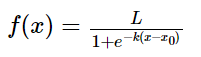  
其中，x0表示了函数曲线的中心（sigmoid midpoint），k是曲线的坡度。  
logistic的几何形状如下所示：  
  
logistic函数在统计学和机器学习领域应用最为广泛或者最为人熟知的是logistic回归模型了。logistic回归（Logistic Regression，简称LR）作为一种对数线性模型（log-linear model）被广泛地应用于分类和回归场景中。此外，logistic函数也是神经网络最为常用的激活函数，即sigmoid函数。  

### SoftMax函数
softMax函数是logistic函数的推广，将k维的real value向量（a1,a2,a3,a4….）映射成一个（b1,b2,b3,b4….）其中bi是一个0-1的常数，然后可以根据bi的大小来进行多分类的任务，如取权重最大的一维  
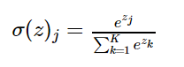  
softmax函数经常用在神经网络的最后一层，作为输出层，进行多分类。此外，softmax在增强学习领域内，softmax经常被用作将某个值转化为激活概率，这类情况下，softmax的公式如下  
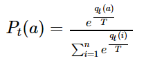  
其中，T被称为是温度参数（temperature parameter）。当T很大时，即趋于正无穷时，所有的激活值对应的激活概率趋近于相同（激活概率差异性较小）；而当T很低时，即趋于0时，不同的激活值对应的激活概率差异也就越大。  

### logistic和softmax的关系
1.logistic具体针对的是二分类问题，而softmax解决的是多分类问题，因此从这个角度也可以理解logistic函数是softmax函数的一个特例  
2.从概率角度来看logistic和softmax函数的区别:softmax建模使用的分布是多项式分布，而logistic则基于伯努利分布  
3.softmax回归和多个logistic回归的关系:  
多个logistic回归通过叠加也同样可以实现多分类的效果，那么多个logistic回归和softmax一样不一样呢？
softmax回归进行的多分类，类与类之间是互斥的，即一个输入只能被归为一类；  
多个logistic回归进行多分类，输出的类别并不是互斥的，即"苹果"这个词语既属于"水果"类也属于"3C"类别。  
	参考：  
	https://www.cnblogs.com/maybe2030/p/5678387.html  
	https://blog.csdn.net/u014422406/article/details/52805924  

### One-Hot编码
One-Hot编码，又称为一位有效编码，主要是采用N位状态寄存器来对N个状态进行编码，每个状态都由他独立的寄存器位，并且在任意时候只有一位有效。  
One-Hot编码是分类变量作为二进制向量的表示。这首先要求将分类值映射到整数值。然后，每个整数值被表示为二进制向量，除了整数的索引之外，它都是零值，它被标记为1  
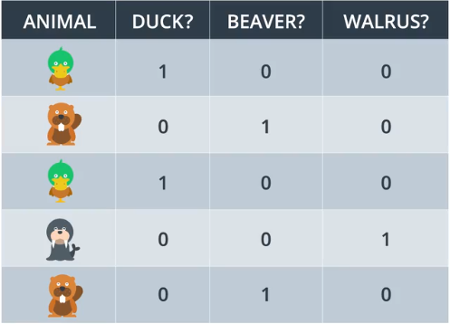  

### 交叉熵（Crocss Entropy）

参考:https://blog.csdn.net/tsyccnh/article/details/79163834  

交叉熵（cross entropy）是深度学习中常用的一个概念，一般用来求目标与预测值之间的差距。  

**信息量：** 当越不可能的事件发生了，我们获取到的信息量就越大。越可能发生的事件发生了，我们获取到的信息量就越小。  
信息量应该和事件发生的概率关系：  
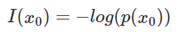  

**熵：** 所有信息量的期望  
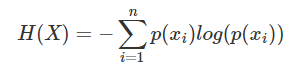  
对于二项分布，熵可以简化为：  
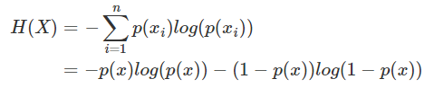  

**相对熵（KL散度）:** 相对熵又称KL散度,如果我们对于同一个随机变量 x 有两个单独的概率分布 P(x) 和 Q(x)，我们可以使用 KL 散度（Kullback-Leibler (KL) divergence）来衡量这两个分布的差异  

在机器学习中，P往往用来表示样本的真实分布，比如[1,0,0]表示当前样本属于第一类。Q用来表示模型所预测的分布，比如[0.7,0.2,0.1]   
直观的理解就是如果用P来描述样本，那么就非常完美。而用Q来描述样本，虽然可以大致描述，但是不是那么的完美，信息量不足，需要额外的一些“信息增量”才能达到和P一样完美的描述。如果我们的Q通过反复训练，也能完美的描述样本，那么就不再需要额外的“信息增量”，Q等价于P  

KL散度的计算公式:  
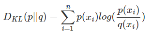  
DKL的值越小，表示q分布和p分布越接近  

**交叉熵：**  
  
变形可以得到：  
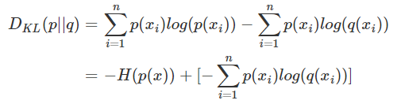  
等式的前一部分恰巧就是p的熵，等式的后一部分，就是交叉熵：  
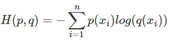  
用来评估label和predicts之间的差距  

在二分类问题中，交叉熵可以变形为：  
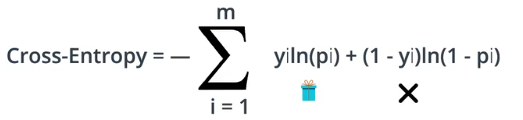  
```
import numpy as np

def cross_entropy(Y, P):
    Y = np.float_(Y)
    P = np.float_(P)
    return -np.sum(Y * np.log(P) + (1 - Y) * np.log(1 - P))
```

### 前向反馈

前向反馈是神经网络用来将输入变成输出的流程  

### 反向传播

进行前向反馈运算。  
将模型的输出与期望的输出进行比较。  
计算误差。  
向后运行前向反馈运算（反向传播），将误差分散到每个权重上。  
更新权重，并获得更好的模型。  
继续此流程，直到获得很好的模型。  

### 早期停止法
通过梯度下降法训练，直到测试误差停止降低并开始增大，停止训练。  
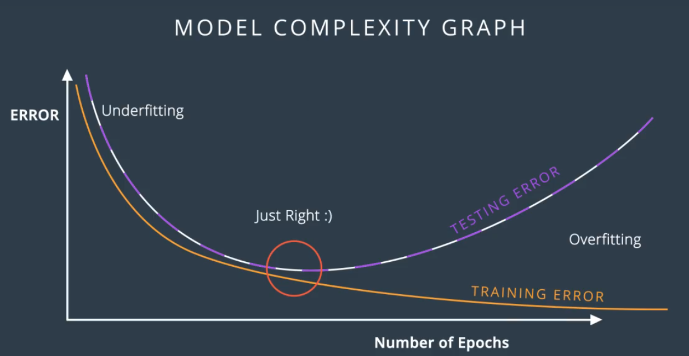  

### 正则化
https://github.com/user-ZJ/Supervised-learning/tree/master/%E7%BA%BF%E6%80%A7%E5%9B%9E%E5%BD%92  

## dropout
问题：在训练神经网络时经常会出现网络某部分权重非常大，最终对训练起到主要作用，而网络的其他部分没有起到多大作用而没有被训练  
dropuot：在训练过程中随机关闭某些节点（不参与训练），有其他节点决定输出结果  

### 局部最低点
通过梯度下降算法，得到从当前数据出发的极小值，并非全局最小值。  
  
### 梯度消失和梯度爆炸
基于反向传播法计算梯度优化的神经网络，由于反向传播求隐藏层梯度时利用了链式法则，梯度值会进行一系列的连乘，导致浅层隐藏层的梯度会出现剧烈的衰减，这也就是梯度消失问题的本源，这种问题对于Sigmoid激活尤为严重，故后来深度网络均使用ReLU激活来缓解这个问题，但即使是ReLU激活也无法避免由于网络单元本身输出的尺度关系，在极深度条件下成百上千次的连乘带来的梯度消失。  
当存在过多的层次时：当前面层梯度小于1，前面的层比后面的层梯度变化更小，故变化更慢，从而引起了梯度消失问题；当梯度大于1，前面层比后面层梯度变化更快，会引起梯度爆炸问题  

引入梯度消失或爆炸原因：一是在神经网络深度过大，二是采用了不合适的损失函数，比如sigmoid  

解决办法：  
1.预训练加微调  
2.梯度剪切、权重正则（针对梯度爆炸）  
3.使用不同的激活函数，如使用ReLU,maxout等替代sigmoid  
4.使用Batch Normalization (BN)  
5.使用残差结构  
6.使用LSTM（long-short term memory networks）网络  

### tanh激活函数
  

### relu激活函数
**优点：**  
 -- 解决了梯度消失、爆炸的问题  
 -- 计算方便，计算速度快  
 -- 加速了网络的训练  
**缺点：**  
-- 由于负数部分恒为0，会导致一些神经元无法激活（可通过设置小学习率部分解决）  
-- 输出不是以0为中心的  
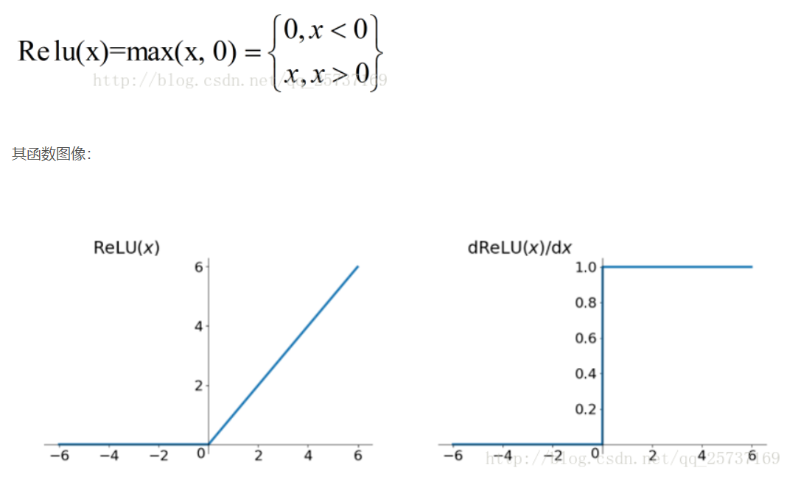  

### 三种梯度下降：批量梯度下降、小批量梯度下降、随机梯度下降
**批量梯度下降(Batch Gradient Descent，简称BGD）：**  在更新每一参数时都使用所有的样本来进行更新  
>优点：全局最优解；易于并行实现；  
>缺点：当样本数目很多时，训练过程会很慢。  

**小批量梯度下降(Mini-batch Gradient Descent，简称MBGD）:**  在更新每一参数时都使用一部分样本来进行更新  

**随机梯度下降(SGD):**  在更新每一参数时都使用一个样本来进行更新  
>优点：训练速度快；  
>缺点：准确度下降，并不是全局最优；不易于并行实现。  

### 学习速率衰退
在模型越来越接近解决方案时，学习率逐渐减小；在TensorFlow中，通过globalstep变量，动态调节学习率，随着训练次数增加，减小学习率。  
decayed_learning_rate = learning_rate / (1 + decay_rate * global_step / decay_step)  
https://blog.csdn.net/Hubz131/article/details/80542632  

### 随机重新开始  
随机选取模型训练初始值，使能够跳过极小值，获得全局最小值  

### 动量
将当前步长和前面梯度下降步长关联，获取前几步的加权平均值，以便获得动量而不至于陷在局部最低点，获取全局最小值。  
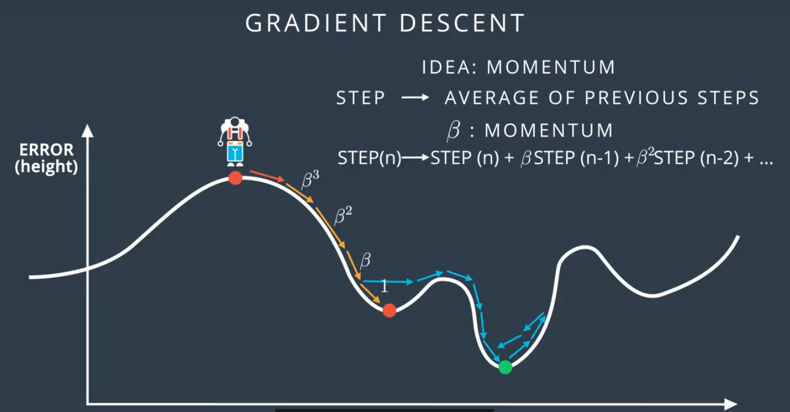  

### 神经网络回归


## CNN（卷积神经网络）
CNN(卷积神经网络)、RNN(循环神经网络)、DNN(深度神经网络)、MLP （多层感知器）  

CNN和MLP比较：  
相同点：都是由输入层，隐藏层，输出层组成；使用相同的优化程序来最小化所选的损失函数；需要固定大小的输入  
不同点：CNN可以包含隐藏层类型；CNN包含图片空间信息，MLP会丢失图片空间信息；  

DNN：DNN结构和MLP相同，但网络更深。  

CNN相对FC优点：  
1. 保留空间特性  
2. 平移不变性  
3. 权重共享  
4. 局部连接  

### 局部连接和权重共享  
在多层感知器模型中，神经元通常是全部连接，参数较多。而卷积层的参数较少，这也是由卷积层的主要特性即局部连接和共享权重所决定。  

**局部连接：**  每个神经元仅与输入神经元的一块区域连接，这块局部区域称作**感受野（receptive field）**。  
在图像卷积操作中，即神经元在空间维度（spatial dimension）是局部连接，但在深度上是全部连接。  
对于二维图像本身而言，也是局部像素关联较强。这种局部连接保证了学习后的过滤器能够对于局部的输入特征有最强的响应。  
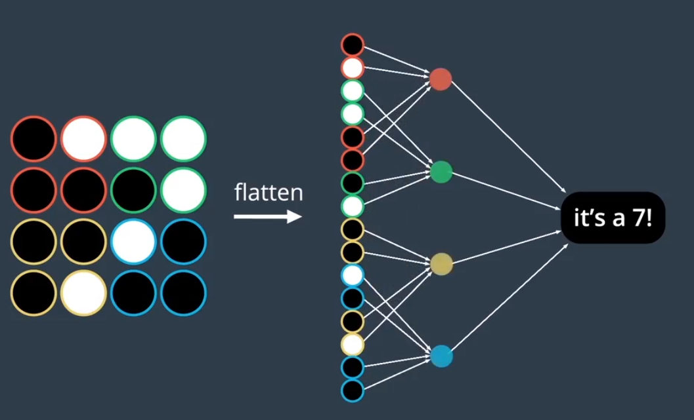  

**权重共享：**  计算同一个深度切片的神经元时采用的滤波器（filter）是共享的。注意权重只是对于同一深度切片的神经元是共享的，在卷积层，通常采用多组卷积核提取不同特征，即对应不同深度切片的特征，不同深度切片的神经元权重是不共享。另外，偏重对同一深度切片的所有神经元都是共享的。  

**局部连接和权重共享都是为了减少神经网络参数，降低过拟合**  

### filter（滤波器）
filter把图片分成小块patch，这些 patch 的大小与滤波器一样大。在CNN中通常会有多个滤波器，每个滤波器提取patch的不同特征。例如，一个滤波器寻找特定颜色，另一个寻找特定物体的特定形状。  
**filter depth(滤波器深度)：**  卷积层滤波器的数量被称为滤波器深度。  
假设filter depth为k，即从每个patch中提取k个特征，那么每个patch与下一层k个神经元相连接，对k个特征进行拟合。  
filter通常是2 \* 2 到 5 \* 5的正方形。  

### Stride和填充（padding）
stride:filter每次移动单元格个数  
padding：边缘是否填充  

### keras中使用卷积层  
```
from keras.models import Sequential
from keras.layers import Conv2D

model = Sequential()
model.add(Conv2D(filters=32, kernel_size=3, strides=2, padding='same', 
    activation='relu', input_shape=(128, 128, 3)))
model.summary()
```
* filters - 过滤器数量。  
* kernel_size - 指定（方形）卷积窗口的高和宽的数字。  
* strides - 卷积 stride。如果不指定任何值，则 strides 设为 1。  
* padding - 选项包括 'valid' 和 'same'。如果不指定任何值，则 padding 设为 'valid'。  
* activation - 通常为 'relu'。如果未指定任何值，则不应用任何激活函数。  
* input_shape - 指定输入的高度、宽度和深度（按此顺序）的元组。在模型中将卷积层当做第一层级（出现在输入层之后）时，必须提供另一个 input_shape 参数，在模型中将卷积层当做第一层级（出现在输入层之后）时，必须提供另一个 input_shape 参数  

### 卷积层计算公式

* K - 卷积层中的过滤器数量  
* F - 卷积过滤器的高度和宽度  
* D_in - 上一层级的深度  
* H_in - 上一层级的高度   
* W_in - 上一层级的宽度  
* S - stride值

卷积层参数数量为： K \* F \* F * D_in + K  
> 每个过滤器有 F \* F * D_in 个权重，有 1 个偏差项  

卷积层形状(ceil返回大于或者等于指定表达式的最小整数)：  
如果 padding = 'same'，那么卷积层的空间维度如下：  

    height = ceil(float(H_in) / float(S))  
    width = ceil(float(W_in) / float(S))  

如果 padding = 'valid'，那么卷积层的空间维度如下:  

    height = ceil(float(H_in - F + 1) / float(S))  
    width = ceil(float(W_in - F + 1) / float(S))  
  
### 池化层
最大池化  
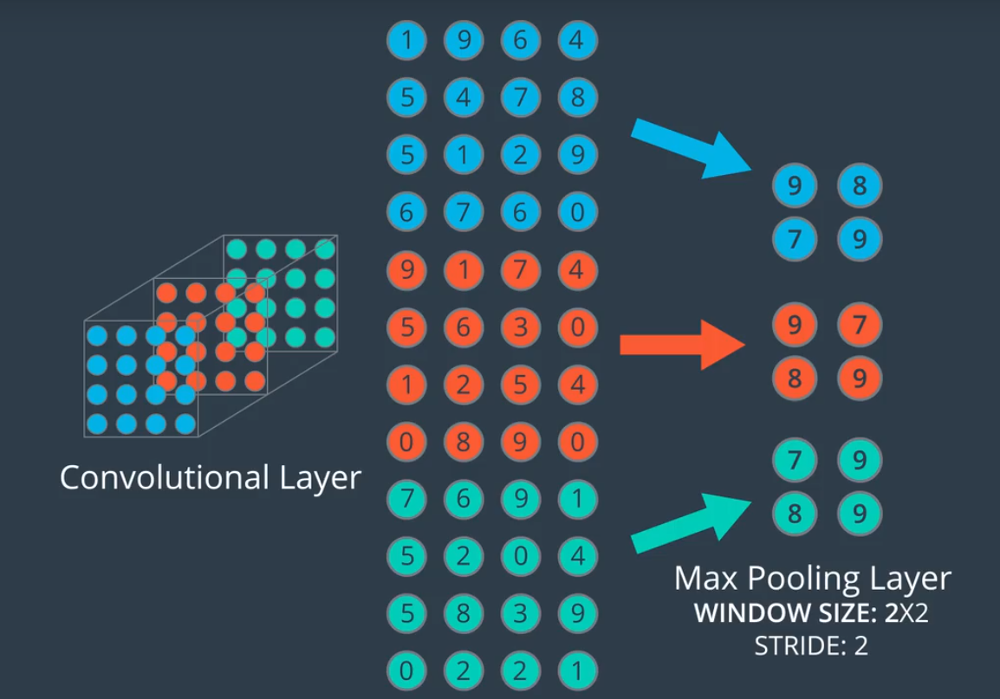  

全局平均池化  
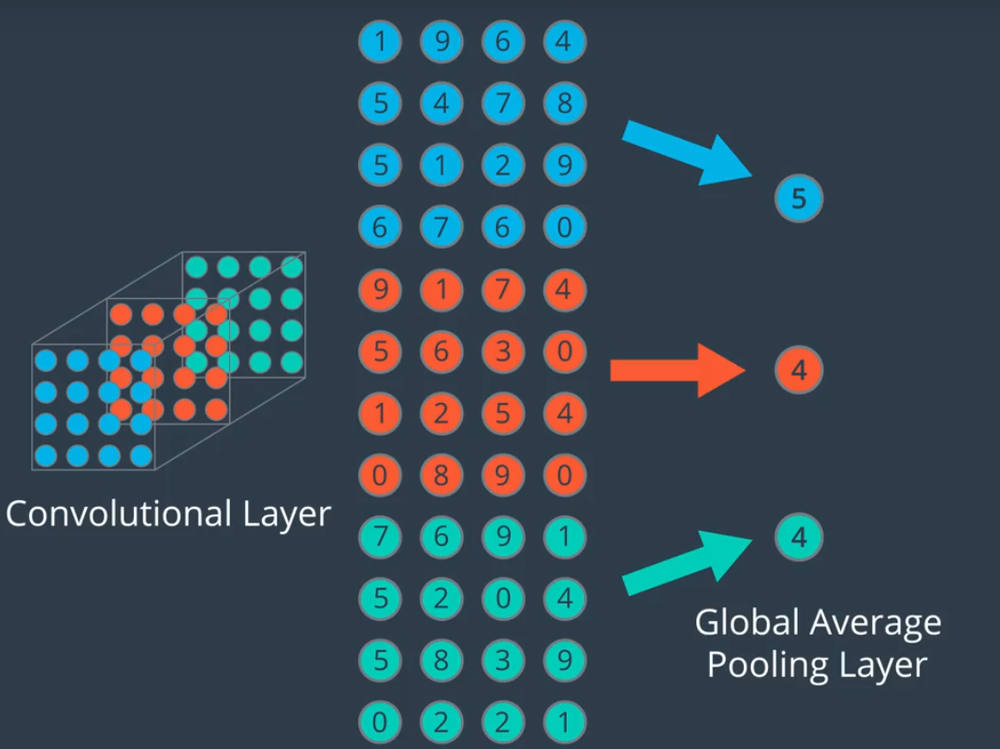  

### keras中使用池化层
**最大池化**  
```
from keras.models import Sequential
from keras.layers import MaxPooling2D

model = Sequential()
model.add(MaxPooling2D(pool_size=2, strides=2, input_shape=(100, 100, 15)))
model.summary()
```
* pool_size - 指定池化窗口高度和宽度的数字。  
* strides - 垂直和水平 stride。如果不指定任何值，则 strides 默认为 pool_size。  
* padding - 选项包括 'valid' 和 'same'。如果不指定任何值，则 padding 设为 'valid'。  

** 卷积层使穿过卷积层的数组更深；最大池化用于减小空间维度；**  

### keras中使用CNN  
**MLP实例：**keras\cifar10_mlp  
**CNN实例：**keras\cifar10_cnn  

```
from keras.models import Sequential
from keras.layers import Conv2D, MaxPooling2D, Flatten, Dense, Dropout

model = Sequential()
model.add(Conv2D(filters=16, kernel_size=2, padding='same', activation='relu', 
                        input_shape=(32, 32, 3)))
model.add(MaxPooling2D(pool_size=2))
model.add(Conv2D(filters=32, kernel_size=2, padding='same', activation='relu'))
model.add(MaxPooling2D(pool_size=2))
model.add(Conv2D(filters=64, kernel_size=2, padding='same', activation='relu'))
model.add(MaxPooling2D(pool_size=2))
model.add(Dropout(0.3))
model.add(Flatten())
model.add(Dense(500, activation='relu'))
model.add(Dropout(0.4))
model.add(Dense(10, activation='softmax'))

model.summary()
```
	_________________________________________________________________
	Layer (type)                 Output Shape              Param #   
	=================================================================
	conv2d_1 (Conv2D)            (None, 32, 32, 16)        208       卷积层，是深度增大为filter个数 16
	_________________________________________________________________
	max_pooling2d_1 (MaxPooling2 (None, 16, 16, 16)        0         最大池化，使长框变为原来的1/2
	_________________________________________________________________
	conv2d_2 (Conv2D)            (None, 16, 16, 32)        2080      
	_________________________________________________________________
	max_pooling2d_2 (MaxPooling2 (None, 8, 8, 32)          0         
	_________________________________________________________________
	conv2d_3 (Conv2D)            (None, 8, 8, 64)          8256      
	_________________________________________________________________
	max_pooling2d_3 (MaxPooling2 (None, 4, 4, 64)          0         
	_________________________________________________________________
	dropout_1 (Dropout)          (None, 4, 4, 64)          0         
	_________________________________________________________________
	flatten_1 (Flatten)          (None, 1024)              0         扁平化为4*4*16=1024的向量
	_________________________________________________________________
	dense_1 (Dense)              (None, 500)               512500    
	_________________________________________________________________
	dropout_2 (Dropout)          (None, 500)               0         
	_________________________________________________________________
	dense_2 (Dense)              (None, 10)                5010      
	=================================================================
	Total params: 528,054
	Trainable params: 528,054
	Non-trainable params: 0
	_________________________________________________________________


### 图片增强

**图片增强实例：**keras\cifar10_augmentation  

```
from keras.preprocessing.image import ImageDataGenerator

# create and configure augmented image generator
datagen_train = ImageDataGenerator(
    width_shift_range=0.1,  # randomly shift images horizontally (10% of total width)
    height_shift_range=0.1,  # randomly shift images vertically (10% of total height)
    horizontal_flip=True) # randomly flip images horizontally

# fit augmented image generator on data
datagen_train.fit(x_train)


# take subset of training data
x_train_subset = x_train[:12]

# visualize subset of training data
fig = plt.figure(figsize=(20,2))
for i in range(0, len(x_train_subset)):
    ax = fig.add_subplot(1, 12, i+1)
    ax.imshow(x_train_subset[i])
fig.suptitle('Subset of Original Training Images', fontsize=20)
plt.show()

# visualize augmented images
fig = plt.figure(figsize=(20,2))
for x_batch in datagen_train.flow(x_train_subset, batch_size=12):
    for i in range(0, 12):
        ax = fig.add_subplot(1, 12, i+1)
        ax.imshow(x_batch[i])
    fig.suptitle('Augmented Images', fontsize=20)
    plt.show()
    break;
```

### CNN架构
* AlexNet：[paper](http://papers.nips.cc/paper/4824-imagenet-classification-with-deep-convolutional-neural-networks.pdf)  
imagenet-classification-with-deep-convolutional-neural-networks.pdf  
* VGGNet：[paper](https://arxiv.org/pdf/1409.1556.pdf)  
VERY DEEP CONVOLUTIONAL NETWORKS FOR LARGE-SCALE IMAGE RECOGNITION.pdf  
* ResNet:[paper](https://arxiv.org/pdf/1512.03385v1.pdf)  
Deep Residual Learning for Image Recognition.pdf  

* keras中CNN应用  
https://keras.io/applications/  

* 梯度消失处理方法  
http://neuralnetworksanddeeplearning.com/chap5.html  

* 各种CNN性能对比  
https://github.com/jcjohnson/cnn-benchmarks  


### 迁移学习
迁移学习是指对提前训练过的神经网络进行调整，以用于新的不同数据集。  
取决于以下两个条件：  
* 新数据集的大小，以及  
* 新数据集与原始数据集的相似程度  

使用迁移学习的方法将各不相同。有以下四大主要情形：  
1. 新数据集很小，新数据与原始数据相似  
2. 新数据集很小，新数据不同于原始训练数据  
3. 新数据集很大，新数据与原始训练数据相似  
4. 新数据集很大，新数据不同于原始训练数据  

**情形 1：小数据集，相似数据**  

    1. 删除神经网络的最后层级  
    2. 添加一个新的完全连接层，与新数据集中的类别数量相匹配  
    3. 随机化设置新的完全连接层的权重；冻结预先训练过的网络中的所有权重  
    4. 训练该网络以更新新连接层的权重  
    
> 为了避免小数据集出现过拟合现象，原始网络的权重将保持不变，而不是重新训练这些权重  
> 因为数据集比较相似，每个数据集的图片将具有相似的更高级别特征。因此，大部分或所有预先训练过的神经网络层级已经包含关于新数据集的相关信息，应该保持不变。  

  

**情形 2：小型数据集、不同的数据**  
    1. 将靠近网络开头的大部分预先训练过的层级删掉  
    2. 向剩下的预先训练过的层级添加新的完全连接层，并与新数据集的类别数量相匹配  
    3. 随机化设置新的完全连接层的权重；冻结预先训练过的网络中的所有权重  
    4. 训练该网络以更新新连接层的权重  

> 因为数据集很小，因此依然需要注意过拟合问题。要解决过拟合问题，原始神经网络的权重应该保持不变，就像第一种情况那样。  
但是原始训练集和新的数据集并不具有相同的更高级特征。在这种情况下，新的网络仅使用包含更低级特征的层级。  

  

**情形 3：大型数据集、相似数据**  
    1. 删掉最后的完全连接层，并替换成与新数据集中的类别数量相匹配的层级  
    2. 随机地初始化新的完全连接层的权重  
    3. 使用预先训练过的权重初始化剩下的权重  
    4. 重新训练整个神经网络  

> 训练大型数据集时，过拟合问题不严重；因此，你可以重新训练所有权重。  
因为原始训练集和新的数据集具有相同的更高级特征，因此使用整个神经网络  

  

**情形 4：大型数据集、不同的数据**  
    1. 删掉最后的完全连接层，并替换成与新数据集中的类别数量相匹配的层级  
    2. 使用随机初始化的权重重新训练网络  
    3. 或者，可以采用和“大型相似数据”情形的同一策略  

> 虽然数据集与训练数据不同，但是利用预先训练过的网络中的权重进行初始化可能使训练速度更快。因此这种情形与大型相似数据集这一情形完全相同。  
> 如果使用预先训练过的网络作为起点不能生成成功的模型，另一种选择是随机地初始化卷积神经网络权重，并从头训练网络。  

  

### keras中使用迁移学习
将VGG16最后三层去除：bottleneck_features.ipynb  
加载去除后三层的VGG16，进行迁移学习，transfer_learning.ipynb  

```
bottleneck_features = np.load('bottleneck_features/DogVGG16Data.npz')
train_vgg16 = bottleneck_features['train']
valid_vgg16 = bottleneck_features['valid']
test_vgg16 = bottleneck_features['test']

model = Sequential()
model.add(GlobalAveragePooling2D(input_shape=(7, 7, 512)))
model.add(Dense(133, activation='softmax'))
model.summary()

model.compile(loss='categorical_crossentropy', optimizer='rmsprop', 
                  metrics=['accuracy'])

# train the model
checkpointer = ModelCheckpoint(filepath='dogvgg16.weights.best.hdf5', verbose=1, 
                               save_best_only=True)
model.fit(train_vgg16, train_targets, epochs=20, validation_data=(valid_vgg16,valid_targets), callbacks=[checkpointer], verbose=1, shuffle=True)

# load the weights that yielded the best validation accuracy
model.load_weights('dogvgg16.weights.best.hdf5')

# get index of predicted dog breed for each image in test set
vgg16_predictions = [np.argmax(model.predict(np.expand_dims(feature, axis=0))) 
                     for feature in test_vgg16]

# report test accuracy
test_accuracy = 100*np.sum(np.array(vgg16_predictions)==
                           np.argmax(test_targets, axis=1))/len(vgg16_predictions)
print('\nTest accuracy: %.4f%%' % test_accuracy)
```


**使用CNN进行对象定位：**  https://github.com/alexisbcook/ResNetCAM-keras  
**使用可视化机器更好地理解瓶颈特征**  https://github.com/alexisbcook/keras_transfer_cifar10  


