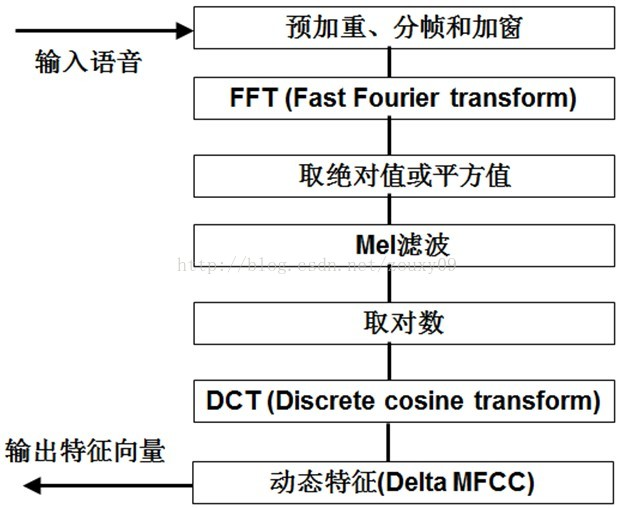
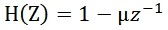
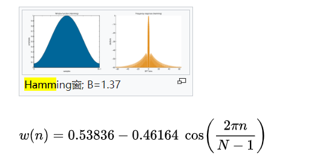
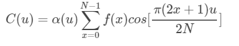
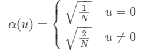
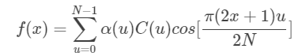

# MFCC
梅尔倒谱系数（Mel-scale Frequency Cepstral Coefficients，简称MFCC）是在Mel标度频率域提取出来的倒谱参数  

1. 先对语音进行预加重、分帧和加窗  
	加窗：将每一帧代入窗函数，窗外的值设定为0，其目的是消除各个帧两端可能会造成的信号不连续性。常用的窗函数有方窗、汉明窗和汉宁窗等，根据窗函数的频域特性，常采用汉明窗。   
2. 对每一个短时分析窗，通过FFT得到对应的频谱  
3. 将上面的频谱通过Mel滤波器组得到Mel频谱；  
4. 在Mel频谱上面进行倒谱分析（取对数，做逆变换，实际逆变换一般是通过DCT离散余弦变换来实现，取DCT后的第2个到第13个系数作为MFCC系数），获得Mel频率倒谱系数MFCC，这个MFCC就是这帧语音的特征  

### 预加重
  
u的值介于0.9-1.0之间，我们通常取0.97。预加重的目的是提升高频部分，使信号的频谱变得平坦，保持在低频到高频的整个频带中，能用同样的信噪比求频谱。同时，也是为了消除发生过程中声带和嘴唇的效应，来补偿语音信号受到发音系统所抑制的高频部分，也为了突出高频的共振峰。    

	//preemph默认为0.97
	public double [] preemphasis(double [] signal,double preemph) {
		double[] arr = new double[signal.length];
		arr[0] = signal[0];
		for(int i=0;i<signal.length-1;i++) {
			arr[i+1] = signal[i+1]-preemph*signal[i];
		}
		return arr;
	}

### 分帧
先将N个采样点集合成一个观测单位，称为帧。通常情况下N的值为256或512，涵盖的时间约为20~30ms左右。为了避免相邻两帧的变化过大，因此会让两相邻帧之间有一段重叠区域，此重叠区域包含了M个取样点，通常M的值约为N的1/2或1/3。  

	//frame_len帧长默认为25ms，frame_step帧移为10ms
	public double [][] framesig(double [] signal,int frame_len,int frame_step){
		int slen = signal.length;
		int numframes;
		if(slen <= frame_len) {
			numframes = 1;
		}else {
			numframes =  (int) (1 + Math.ceil((1.0*slen - frame_len)/frame_step));
		}
		int padlen = (numframes-1)*frame_step + frame_len;  //分帧数据不够时，补0后的的数据长度
		double [][] frames = new double[numframes][frame_len];
		if(padlen>slen) {
			double [] signal_new = new double[padlen];
			System.arraycopy(signal, 0, signal_new, 0, slen);
			for(int i=0;i<numframes;i++) {
				System.arraycopy(signal_new, i*frame_step, frames[i], 0, frame_len);
			}
		}else {
			for(int i=0;i<numframes;i++) {
				System.arraycopy(signal, i*frame_step, frames[i], 0, frame_len);
			}
		}
		return frames;
	}

### 加窗
通常使用hamming窗  
   

	//加窗
	public double [][] hamming(double [][] data){
		int [] shape = {data.length,data[0].length};
		double [][] win_data = new double[shape[0]][shape[1]];
		for(int i=0;i<shape[0];i++) {
			for(int j=0;j<shape[1];j++) {
				double ham = 0.54 - 0.46*Math.cos(2.0*Math.PI*j/(shape[1]-1));
				win_data[i][j] = data[i][j]*ham;
			}
		}
		return win_data;
	}

### 计算能量谱，RFFT、取平方
	//计算能量谱,输入NxD，输出Nx(NFFT/2+1)
	public double [][] powspec(double [][] frames){
		//nfft默认为256
		int framelen = frames[0].length>this.nfft?frames[0].length:this.nfft;
		double [][] framesData = new double[frames.length][framelen];
		double [] frameData = null;
		if(frames[0].length > this.nfft) {
			System.out.println("frame length "+ frames[0].length+"is greater than FFT size "+this.nfft+", frame will be truncated. Increase NFFT to avoid.");
		}
		for(int i=0;i<frames.length;i++) {
			frameData = new double[framelen];
			System.arraycopy(frames[i], 0, frameData, 0, frames[i].length<this.nfft?frames[i].length:this.nfft);
			RealDoubleFFT rfft = new RealDoubleFFT(framelen);
			rfft.ft(frameData);
			double [] spec = new double[framelen/2+1];
			spec[0] = Math.pow(frameData[0], 2)/this.nfft;
			for(int j=1;j<framelen;j=j+2) {
				if(j+1<framelen) {
					spec[j/2+1]=(Math.pow(frameData[j], 2) + Math.pow(frameData[j+1], 2))/this.nfft; 
				}else {
					spec[j/2+1]=Math.pow(frameData[j], 2) /this.nfft;
				}	
			}
			framesData[i]= spec;
		}
		return framesData;
	}

## 计算每帧能量总和
MFCC使用每帧能量总和的对数替换该帧的MFCC的第一个特征  
	mfccFeature[i][0] = Math.log(energy[i])

	public double [] getEnergy(double [][] mPowSpec) {
		double [] mEnergy = new double[mPowSpec.length];
		for(int i=0;i<mPowSpec.length;i++) {
			double sum = 0.0;
			for(int j=0;j<mPowSpec[0].length;j++) {
				sum += mPowSpec[i][j];
			}
			mEnergy[i]=sum==0.0?this.epsilon:sum;
		}
		return mEnergy;
	}

## Mel滤波器
	产生nfilt * (nfft//2+1)的矩阵最为mel滤波器组，将能量谱和mel滤波器组进行矩阵相乘  
	double [][] getFilterbanks() {
		int nfilt=this.nfilt;  //mel滤波器个数，默认为26
		int nfft=this.nfft;    //fft size,默认为256
		int samplerate=this.sampleRate; //默认为8K
		double lowfreq=this.lowerFilterFreq; //默认为20
		double highfreq = this.upperFilterFreq; //默认为3700
		double lowmel = AudioUtil.hz2mel(lowfreq);
		double highmel = AudioUtil.hz2mel(highfreq);
		double [] bin = new double[nfilt+2];
		for(int i=0;i<nfilt+2;i++) {
			bin[i] = Math.floor(AudioUtil.mel2hz(lowmel+(highmel-lowmel)*i/(nfilt+1))*(nfft+1)/samplerate);
		}
		double [][] fbank = new double[nfilt][nfft/2+1];
		for(int j=0;j<nfilt;j++) {
			for(int i= (int)bin[j];i<(int)bin[j+1];i++) {
				fbank[j][i] =  (i - bin[j]) / (bin[j+1]-bin[j]);
			}
			for(int i=(int)bin[j+1];i<(int)bin[j+2];i++) {
				fbank[j][i] = (bin[j+2]-i) / (bin[j+2]-bin[j+1]);
			}
		}
		return fbank;		
	}

## 对能量谱应用mel滤波器
实际就是矩阵相乘，生成梅尔频谱  

## 取对数
对梅尔频谱取对数，生成logmel频谱

## DCT(Discrete Cosine Transform)离散余弦变换
**一维DCT**  
一维离散余弦变换公式为：    
     
N 表示一维序列的长度，即输入数组长度      
x 表示原始图像坐标,即输入数组下标  
u为对应的变换后的坐标，即输出数组下标  
f(x) 表示原图像的在x处的像素，即输入数组在下标x处的值  
u(x)定义如下:   
     
一维DCT逆变换为:   
    

对每帧数据的logmel频谱应用一维DCT  
	
	public double [] dct_1d(double [] pow) {
		int len = pow.length;
		double [] newPow = new double[len];
		for(int k=0;k<len;k++) {
			double sum = 0.0;
			for(int i=0;i<len;i++) {
				sum += pow[i] * Math.cos(2 * Math.PI * k / (2.0 * len) * i + (k * Math.PI) / (2.0 * len));
			}
			double ck;
			if(k==0) {
				ck = Math.sqrt(0.5);
			}else {
				ck = 1.0;
			}
			newPow[k] = Math.sqrt(2.0 / len) * ck * sum;
		}
		double [] dctPow = new double[this.numcep];
		System.arraycopy(newPow, 0, dctPow, 0, this.numcep);
		return dctPow;
	}
	
	public double [][] dct_2d(double [][] mLogmelPowSpec){
		double [][] dctPowSpec = new double[mLogmelPowSpec.length][this.numcep];
		for(int i=0;i<mLogmelPowSpec.length;i++) {
			dctPowSpec[i] = dct_1d(mLogmelPowSpec[i]);
		}
		return dctPowSpec;
	}  

## 求倒谱
求倒谱的特征即为MFCC特征  

	//求倒谱，L为倒谱系数，默认为22
	public double [][] lifter(double [][] mDctPowSpec,int L){
		double [][] lifterPowSpec = new double [mDctPowSpec.length][mDctPowSpec[0].length];
		if(L>0) {
			for(int i=0;i<mDctPowSpec.length;i++) {
				for(int j=0;j<mDctPowSpec[0].length;j++) {
					double s = 1+L/2.0*Math.sin(Math.PI*j/L);
					lifterPowSpec[i][j] = mDctPowSpec[i][j]*s;
				}
			}
			return lifterPowSpec;
		}else {
			return mDctPowSpec;
		}
	}  

## 计算一阶MFCC
连续5帧的MFCC特征加权平均  

	public double [][] delta(double [][] data){
		int width = this.deltaWidth;  //默认为2
		double [][] delta_feat = new double[data.length][data[0].length];
		double [] weight = new double[2*width+1];
		for(int i=0;i<weight.length;i++) {
			weight[i] = i-width;
		}
		double denominator=0;
		for(int i=1;i<width+1;i++) {
			denominator += 2*Math.pow(i,2);
		}
		for(int i=0;i<data.length;i++) {
			for(int j=0;j<data[0].length;j++) {
				delta_feat[i][j] = 0.0;
				for(int k=0;k<weight.length;k++) {
					int index = (int) (i+weight[k]);
					index = Math.max(index, 0);
					index = Math.min(index, data.length-1);
					delta_feat[i][j] += data[index][j]*weight[k];
				}
				delta_feat[i][j] /= denominator;
			}
		}
		return delta_feat;
	}

倒谱分析：
1. 将原语音信号经过傅里叶变换得到频谱：X[k]=H[k]E[k]，只考虑幅度就是：|X[k] |=|H[k]||E[k] |；  
2. 我们在两边取对数：log||X[k] ||= log ||H[k] ||+ log ||E[k] ||。  
3. 再在两边取逆傅里叶变换得到：x[k]=h[k]+e[k]

先将线性频谱映射到基于听觉感知的Mel非线性频谱中，然后转换到倒谱上

在Mel频谱上面获得的倒谱系数h[k]就称为Mel频率倒谱系数，简称MFCC。

https://github.com/JorenSix/TarsosDSP/blob/master/src/core/be/tarsos/dsp/mfcc/MFCC.java

https://github.com/Sciss/SpeechRecognitionHMM/blob/master/src/main/java/org/ioe/tprsa/audio/feature/MFCC.java

https://github.com/chiachunfu/speech/blob/master/speechandroid/src/org/tensorflow/demo/mfcc/MFCC.java

参考：  
https://blog.csdn.net/suan2014/article/details/82021324  
https://blog.csdn.net/class_brick/article/details/82743741