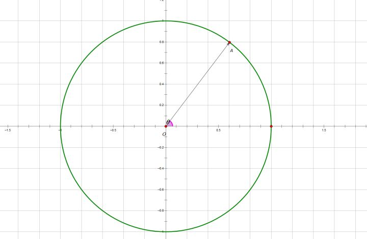
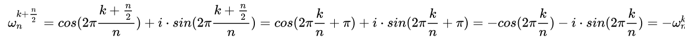
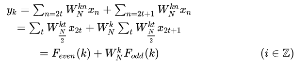
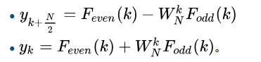

# 前导
在看傅里叶算法是建议先看一下[如果看了此文你还不懂傅里叶变换，那就过来掐死我吧【完整版】](https://zhuanlan.zhihu.com/p/19763358)，理解时域到频域的变换

# 复数中的单位根  
复平面中的单位圆  
  
其中单位根，表示为,其中i表示复数。  
由此可知：  
  
  这就是著名的欧拉幅角公式,是在复平面上定义出来的  
将单位圆等分成N个部分（以单位圆与实轴正半轴的交点一个等分点），以原点为起点，圆的这N个等分点为终点，作出N个向量，其中幅角为正且最小的向量称为N次单位向量，记为 , &plus;isin(-2\pi\frac{1}{N})=e^{-i2\pi\frac{1}{N}}),  &plus;isin(-2\pi\frac{k}{N})=e^{-i2\pi\frac{k}{N}})  
> * 性质一（又称折半引理）  
>   
>   
> 其实由此我们可以引申出:   
> * 性质二:对称性（又称消去引理）  
>   
>   
> * 性质三：周期性  
>   
复平面表示法先介绍到这里，后续会用到以上表示方法和性质。

# 离散傅里叶变换（Discrete Fourier Transform DFT)
令 x0, ...., xN-1 为复数，DFT的正、逆定义形式定义如下：  
  
上图公式中，n:[0,1,2,...,N-1], k:[0,1,2,...,N-1], xn为输入的复数，i表示虚数，N为输入数据长度  
&plus;i*sin(-i2\pi&space;nk/N))    
直接按这个定义求值需要 O(N^2) 次运算：Xk 共有 N 个输出，每个输出需要 N 项求和  
xn 到 Xk 的转化就是空域到频域的转换，这个转换有助于研究信号的功率谱  
	
	//DFT java代码实现
	private Complex omega(int N, int k, int n) {
		// TODO Auto-generated method stub
		return new Complex(Math.cos(-2*Math.PI/N*k*n),Math.sin(-2*Math.PI/N*k*n));
	}
	public Complex [] DFT(Complex [] x) {
		//System.out.println("DFT_slow");
		int N = x.length;
		Complex [] result = new Complex[N];
		for(int k=0;k<N;k++) {
			result[k] = new Complex();
			for(int n=0;n<N;n++) {
				result[k]=result[k].add(x[n].mul(omega(N,k,n)));
			}
		}
		return result;
	}

# 快速傅里叶变换（Fast Fourier Transform, FFT）
快速傅里叶变换是快速计算序列的离散傅里叶变换（DFT）或其逆变换的方法，FFT会通过把DFT矩阵分解为稀疏（大多为零）因子之积来快速计算此类变换。[2] 因此，它能够将计算DFT的复杂度从只用DFT定义计算需要的 O(n^{2})，降低到O(nlog n)，其中n为数据大小

## 库利-图基算法(Cooley-Tukey)
库利-图基算法是最常见的FFT算法。这一方法以分治法为策略递归地将长度为的离散傅里叶变换分解为长度为N1的N2个较短序列的离散傅里叶变换，以及与O(N)个旋转因子的复数乘法。  
库利-图基算法最有名的应用，是将序列长为N 的DFT分割为两个长为N/2 的子序列的DFT，因此这一应用只适用于序列长度为2的幂的DFT计算，即基2-FFT。实际上，如同高斯和Cooley与Tukey都指出的那样，Cooley-Tukey算法也可以用于序列长度N 为任意因数分解形式的DFT，即混合基FFT，而且还可以应用于其他诸如分裂基FFT等变种。尽管Cooley-Tukey算法的基本思路是采用递归的方法进行计算，大多数传统的算法实现都将显式的递归算法改写为非递归的形式。另外，因为Cooley-Tukey算法是将DFT分解为较小长度的多个DFT，因此它可以同任一种其他的DFT算法联合使用。  
下面，我们用N次单位根来表示。满足上面介绍的复数单位根的三条性质。    
为了简单起见，我们下面设待变换序列长度。根据上面单位根的对称性，求级数时，可以将求和区间分为两部分：  
  
)和)是两个分别关于序列奇数号和偶数号序列N/2点变换。由此式只能计算出的前N/2个点，对于后N/2个点，注意)和)都是周期为N/2的函数，由单位根的对称性，于是有以下变换公式：  
  
这样，一个N点变换就分解成了两个N/2点变换。照这样可继续分解下去。这就是库利-图基快速傅里叶变换算法的基本原理
Cooley-Tukey算法实例图解:  
      

	//Cooley-Tukey递归实现  java
	Complex omega(int N,int k) {
		return new Complex(Math.cos(-2*Math.PI/N*k),Math.sin(-2*Math.PI/N*k));
	}
	public Complex [] fft_recurs(Complex [] x) {
		int N = x.length;
		//if(N % 2 != 0) {
		//	return null;
		//}else if(N==32) {
		//	return DFT_slow(x);
		if(N==1) {
			return x;
		}else {
			Complex [] X_even = new Complex[N/2];
			Complex [] X_odd = new Complex[N/2];
			int M = N/2;
			// 按照系数奇偶划分为两半
			for(int i=0;i<M;++i) {
				X_even[i] = x[i*2];
				X_odd[i]=x[i*2+1];
			}
			X_even = fft_recurs(X_even);
			X_odd = fft_recurs(X_odd);
			
			Complex [] result = new Complex[N];
			for(int i=0;i<M;i++) {
				result[i] = new Complex();
				result[i+M]= new Complex();
				result[i] = X_even[i].add(omega(N,i).mul(X_odd[i]));
				result[i+M] = X_even[i].add(omega(N,i+M).mul(X_odd[i]));
			}
			return result;
		}
	}

观察上图实例，首先将个输入点列按二进制进行编号，然后对各个编号按位倒置并按此重新排序。例如，对于一个8点变换,001倒置以后变成 100  
010 → 010  
011 → 110  
100 → 001  
101 → 101  
110 → 011  
111 → 111  
倒置后的编号为{0,4,2,6,1,5,3,7}  
于是我们可以想，先将原数组调整成最底层的位置.然后从倒数第二层由底向上计算。这就是非递归方式来实现FFT 的Cooley-Tukey算法。  

	//Cooley-Tukey非递归实现  java
	public Complex [] fft(Complex [] x) {
		int N = x.length;
		Complex [] omega = new Complex[N];
		for(int k=0;k<N;k++) {
			omega[k] = new Complex(Math.cos(-2 * Math.PI / N * k), Math.sin(-2 * Math.PI / N * k));
		}
		int k = 0;
		while((1<<k)<N) k++;
		//调整数据位置
		for(int i=0;i<N;i++) {
			int t = 0;
			for(int j=0;j<k;j++) {
				if((i & (1 << j))>0) {
					t |=(1<<(k-j-1));
				}
			}
			if(i<t) {
				Complex tmp = new Complex();
				tmp = x[i];
				x[i] = x[t];
				x[t] = tmp;
			}
		}
		//合并数据
		for(int l=2;l<=N;l*=2) {
			int m = l/2;
			for(int p=0;p!=N;p+=l) {
				for(int i=0;i<m;i++) {
					Complex t = new Complex();
					t = omega[N/l*i].mul(x[p+m+i]);
					x[p+m+i] = x[p+i].sub(t);
					x[p+i] = x[p+i].add(t);
				}
			}
		}
		return x;
	}

# 离散傅里叶反变换（Inverse Discrete Fourier Transform）
令 x0, ...., xN-1 为复数，DFT的正、逆定义形式定义如下：  
  
公式形式基本相同，对fft代码做如下修改：  
 
	Complex omega(int N,int k,boolean inverse) {
		if(!inverse) {
			return new Complex(Math.cos(-2*Math.PI/N*k),Math.sin(-2*Math.PI/N*k));
		}
		return new Complex(Math.cos(2*Math.PI/N*k),Math.sin(2*Math.PI/N*k)).conj();
	}
并将最后的值除以N即可。  

# STFT
对于一段很长的非平稳信号，可以假设其在某一段很短的时间内是平稳的，故可以对这一段很短的平稳信号做DFT变换 
STFT的步骤：1. 对信号进行分帧，即使用窗函数函数来截取信号，一般来说，每帧信号都是有重叠的； 2. 对每帧信号做DFT变换，由于DFT具有对称性，每帧都只去DFT的一半点数作为每帧的STFT结果

# 混合基快速傅里叶变换java实现
src\main\java\ca\uol\aig\fftpack   
参考：https://github.com/fjfdeztoro/fftpack  

## rfft和fft区别
rfft：实数傅里叶变换，输入数据为N，输出数据大小为N//2 + 1
fft：虚数傅里叶变换，输入数据为N，输出数据大小为N
	
	import numpy as np
	data = [0, 1, 3, 4, 5]
	print("FFT output\n", np.fft.fft(data))
	print("RFFT output\n", np.fft.rfft(data))  

	FFT output
	[13.+0.j -3.80901699+4.39201132j -2.69098301+1.40008449j -2.69098301-1.40008449j -3.80901699-4.39201132j]
	RFFT output
	[13.+0.j -3.80901699+4.39201132j -2.69098301+1.40008449j]  
	
	注意到fft输出的最后一个元素是第二个元素的复共轭。 即负频率项仅是相应正频率项的复共轭，因此负频率项是冗余的。rfft不计算负频率项，因此输出的长度为n//2+1  

对于jfftpack包，RealDoubleFFT.ft返回的长度为N，其中包含实数和虚数部分的值。
	

参考：  
[wiki:快速傅里叶变换](https://zh.wikipedia.org/wiki/%E5%BF%AB%E9%80%9F%E5%82%85%E9%87%8C%E5%8F%B6%E5%8F%98%E6%8D%A2)  
[理解快速傅里叶变换（FFT）算法](http://blog.jobbole.com/58246/)  
[一小时学会快速傅里叶变换（Fast Fourier Transform）](https://zhuanlan.zhihu.com/p/31584464)  
[FFT 学习笔记](https://oi.men.ci/fft-notes/)  

