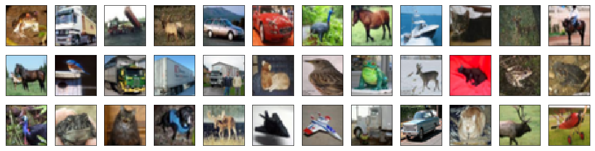
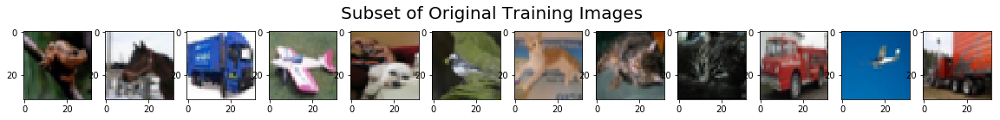

# Artificial Intelligence Nanodegree

## Convolutional Neural Networks

---

In this notebook, we train a CNN on augmented images from the CIFAR-10 database.

### 1. Load CIFAR-10 Database


```python
import keras
from keras.datasets import cifar10

# load the pre-shuffled train and test data
(x_train, y_train), (x_test, y_test) = cifar10.load_data()
```

    D:\anaconda\lib\site-packages\h5py\__init__.py:36: FutureWarning: Conversion of the second argument of issubdtype from `float` to `np.floating` is deprecated. In future, it will be treated as `np.float64 == np.dtype(float).type`.
      from ._conv import register_converters as _register_converters
    Using TensorFlow backend.
    

### 2. Visualize the First 24 Training Images


```python
import numpy as np
import matplotlib.pyplot as plt
%matplotlib inline

fig = plt.figure(figsize=(20,5))
for i in range(36):
    ax = fig.add_subplot(3, 12, i + 1, xticks=[], yticks=[])
    ax.imshow(np.squeeze(x_train[i]))
```





### 3. Rescale the Images by Dividing Every Pixel in Every Image by 255


```python
# rescale [0,255] --> [0,1]
x_train = x_train.astype('float32')/255
x_test = x_test.astype('float32')/255 
```

### 4.  Break Dataset into Training, Testing, and Validation Sets


```python
from keras.utils import np_utils

# break training set into training and validation sets
(x_train, x_valid) = x_train[5000:], x_train[:5000]
(y_train, y_valid) = y_train[5000:], y_train[:5000]

# one-hot encode the labels
num_classes = len(np.unique(y_train))
y_train = keras.utils.to_categorical(y_train, num_classes)
y_test = keras.utils.to_categorical(y_test, num_classes)
y_valid = keras.utils.to_categorical(y_valid, num_classes)

# print shape of training set
print('x_train shape:', x_train.shape)

# print number of training, validation, and test images
print(x_train.shape[0], 'train samples')
print(x_test.shape[0], 'test samples')
print(x_valid.shape[0], 'validation samples')
```

    x_train shape: (45000, 32, 32, 3)
    45000 train samples
    10000 test samples
    5000 validation samples
    

### 5. Create and Configure Augmented Image Generator


```python
from keras.preprocessing.image import ImageDataGenerator

# create and configure augmented image generator
datagen_train = ImageDataGenerator(
    width_shift_range=0.1,  # randomly shift images horizontally (10% of total width)
    height_shift_range=0.1,  # randomly shift images vertically (10% of total height)
    horizontal_flip=True) # randomly flip images horizontally

# fit augmented image generator on data
datagen_train.fit(x_train)
```

### 6. Visualize Original and Augmented Images


```python
import matplotlib.pyplot as plt

# take subset of training data
x_train_subset = x_train[:12]

# visualize subset of training data
fig = plt.figure(figsize=(20,2))
for i in range(0, len(x_train_subset)):
    ax = fig.add_subplot(1, 12, i+1)
    ax.imshow(x_train_subset[i])
fig.suptitle('Subset of Original Training Images', fontsize=20)
plt.show()

# visualize augmented images
fig = plt.figure(figsize=(20,2))
for x_batch in datagen_train.flow(x_train_subset, batch_size=12):
    for i in range(0, 12):
        ax = fig.add_subplot(1, 12, i+1)
        ax.imshow(x_batch[i])
    fig.suptitle('Augmented Images', fontsize=20)
    plt.show()
    break;
```





### 7. Define the Model Architecture 


```python
from keras.models import Sequential
from keras.layers import Conv2D, MaxPooling2D, Flatten, Dense, Dropout

model = Sequential()
model.add(Conv2D(filters=16, kernel_size=2, padding='same', activation='relu', 
                        input_shape=(32, 32, 3)))
model.add(MaxPooling2D(pool_size=2))
model.add(Conv2D(filters=32, kernel_size=2, padding='same', activation='relu'))
model.add(MaxPooling2D(pool_size=2))
model.add(Conv2D(filters=64, kernel_size=2, padding='same', activation='relu'))
model.add(MaxPooling2D(pool_size=2))
model.add(Dropout(0.3))
model.add(Flatten())
model.add(Dense(500, activation='relu'))
model.add(Dropout(0.4))
model.add(Dense(10, activation='softmax'))

model.summary()
```

    _________________________________________________________________
    Layer (type)                 Output Shape              Param #   
    =================================================================
    conv2d_1 (Conv2D)            (None, 32, 32, 16)        208       
    _________________________________________________________________
    max_pooling2d_1 (MaxPooling2 (None, 16, 16, 16)        0         
    _________________________________________________________________
    conv2d_2 (Conv2D)            (None, 16, 16, 32)        2080      
    _________________________________________________________________
    max_pooling2d_2 (MaxPooling2 (None, 8, 8, 32)          0         
    _________________________________________________________________
    conv2d_3 (Conv2D)            (None, 8, 8, 64)          8256      
    _________________________________________________________________
    max_pooling2d_3 (MaxPooling2 (None, 4, 4, 64)          0         
    _________________________________________________________________
    dropout_1 (Dropout)          (None, 4, 4, 64)          0         
    _________________________________________________________________
    flatten_1 (Flatten)          (None, 1024)              0         
    _________________________________________________________________
    dense_1 (Dense)              (None, 500)               512500    
    _________________________________________________________________
    dropout_2 (Dropout)          (None, 500)               0         
    _________________________________________________________________
    dense_2 (Dense)              (None, 10)                5010      
    =================================================================
    Total params: 528,054
    Trainable params: 528,054
    Non-trainable params: 0
    _________________________________________________________________
    

### 8. Compile the Model 


```python
# compile the model
model.compile(loss='categorical_crossentropy', optimizer='rmsprop', 
                  metrics=['accuracy'])
```

### 9. Train the Model 


```python
from keras.callbacks import ModelCheckpoint   

batch_size = 32
epochs = 100

# train the model
checkpointer = ModelCheckpoint(filepath='aug_model.weights.best.hdf5', verbose=1, 
                               save_best_only=True)
model.fit_generator(datagen_train.flow(x_train, y_train, batch_size=batch_size),
                    steps_per_epoch=x_train.shape[0] // batch_size,
                    epochs=epochs, verbose=2, callbacks=[checkpointer],
                    validation_data=(x_valid, y_valid),
                    validation_steps=x_valid.shape[0] // batch_size)
```

    Epoch 1/100
     - 18s - loss: 1.6619 - acc: 0.3962 - val_loss: 1.3093 - val_acc: 0.5284
    
    Epoch 00001: val_loss improved from inf to 1.30930, saving model to aug_model.weights.best.hdf5
    Epoch 2/100
     - 15s - loss: 1.3935 - acc: 0.4959 - val_loss: 1.3050 - val_acc: 0.5214
    
    Epoch 00002: val_loss improved from 1.30930 to 1.30495, saving model to aug_model.weights.best.hdf5
    Epoch 3/100
     - 15s - loss: 1.2962 - acc: 0.5361 - val_loss: 1.0829 - val_acc: 0.6136
    
    Epoch 00003: val_loss improved from 1.30495 to 1.08290, saving model to aug_model.weights.best.hdf5
    Epoch 4/100
     - 15s - loss: 1.2357 - acc: 0.5607 - val_loss: 1.0598 - val_acc: 0.6212
    
    Epoch 00004: val_loss improved from 1.08290 to 1.05975, saving model to aug_model.weights.best.hdf5
    Epoch 5/100
     - 14s - loss: 1.2063 - acc: 0.5740 - val_loss: 1.0898 - val_acc: 0.6044
    
    Epoch 00005: val_loss did not improve from 1.05975
    Epoch 6/100
     - 14s - loss: 1.1889 - acc: 0.5847 - val_loss: 1.0022 - val_acc: 0.6562
    
    Epoch 00006: val_loss improved from 1.05975 to 1.00224, saving model to aug_model.weights.best.hdf5
    Epoch 7/100
     - 15s - loss: 1.1840 - acc: 0.5902 - val_loss: 1.0948 - val_acc: 0.6264
    
    Epoch 00007: val_loss did not improve from 1.00224
    Epoch 8/100
     - 15s - loss: 1.1804 - acc: 0.5927 - val_loss: 1.0461 - val_acc: 0.6324
    
    Epoch 00008: val_loss did not improve from 1.00224
    Epoch 9/100
     - 15s - loss: 1.1862 - acc: 0.5933 - val_loss: 1.0540 - val_acc: 0.6352
    
    Epoch 00009: val_loss did not improve from 1.00224
    Epoch 10/100
     - 16s - loss: 1.1907 - acc: 0.5910 - val_loss: 1.0494 - val_acc: 0.6472
    
    Epoch 00010: val_loss did not improve from 1.00224
    Epoch 11/100
     - 16s - loss: 1.2048 - acc: 0.5887 - val_loss: 1.0340 - val_acc: 0.6610
    
    Epoch 00011: val_loss did not improve from 1.00224
    Epoch 12/100
     - 15s - loss: 1.2225 - acc: 0.5837 - val_loss: 1.2239 - val_acc: 0.5986
    
    Epoch 00012: val_loss did not improve from 1.00224
    Epoch 13/100
     - 16s - loss: 1.2296 - acc: 0.5790 - val_loss: 1.0788 - val_acc: 0.6460
    
    Epoch 00013: val_loss did not improve from 1.00224
    Epoch 14/100
     - 16s - loss: 1.2416 - acc: 0.5805 - val_loss: 0.9903 - val_acc: 0.6654
    
    Epoch 00014: val_loss improved from 1.00224 to 0.99032, saving model to aug_model.weights.best.hdf5
    Epoch 15/100
     - 16s - loss: 1.2685 - acc: 0.5705 - val_loss: 1.0379 - val_acc: 0.6472
    
    Epoch 00015: val_loss did not improve from 0.99032
    Epoch 16/100
     - 15s - loss: 1.2819 - acc: 0.5677 - val_loss: 1.0749 - val_acc: 0.6328
    
    Epoch 00016: val_loss did not improve from 0.99032
    Epoch 17/100
     - 15s - loss: 1.3044 - acc: 0.5587 - val_loss: 1.2592 - val_acc: 0.6128
    
    Epoch 00017: val_loss did not improve from 0.99032
    Epoch 18/100
     - 15s - loss: 1.3127 - acc: 0.5575 - val_loss: 1.0446 - val_acc: 0.6304
    
    Epoch 00018: val_loss did not improve from 0.99032
    Epoch 19/100
     - 15s - loss: 1.3246 - acc: 0.5545 - val_loss: 1.0977 - val_acc: 0.6270
    
    Epoch 00019: val_loss did not improve from 0.99032
    Epoch 20/100
     - 14s - loss: 1.3587 - acc: 0.5434 - val_loss: 1.2058 - val_acc: 0.5986
    
    Epoch 00020: val_loss did not improve from 0.99032
    Epoch 21/100
     - 14s - loss: 1.3629 - acc: 0.5384 - val_loss: 1.1729 - val_acc: 0.6024
    
    Epoch 00021: val_loss did not improve from 0.99032
    Epoch 22/100
     - 15s - loss: 1.3797 - acc: 0.5353 - val_loss: 1.1786 - val_acc: 0.6040
    
    Epoch 00022: val_loss did not improve from 0.99032
    Epoch 23/100
     - 14s - loss: 1.3821 - acc: 0.5355 - val_loss: 1.2103 - val_acc: 0.5748
    
    Epoch 00023: val_loss did not improve from 0.99032
    Epoch 24/100
     - 15s - loss: 1.3939 - acc: 0.5239 - val_loss: 1.0923 - val_acc: 0.6300
    
    Epoch 00024: val_loss did not improve from 0.99032
    Epoch 25/100
     - 15s - loss: 1.3961 - acc: 0.5244 - val_loss: 1.1956 - val_acc: 0.5976
    
    Epoch 00025: val_loss did not improve from 0.99032
    Epoch 26/100
     - 14s - loss: 1.4224 - acc: 0.5206 - val_loss: 1.0862 - val_acc: 0.6282
    
    Epoch 00026: val_loss did not improve from 0.99032
    Epoch 27/100
     - 15s - loss: 1.4251 - acc: 0.5161 - val_loss: 1.1706 - val_acc: 0.6128
    
    Epoch 00027: val_loss did not improve from 0.99032
    Epoch 28/100
     - 15s - loss: 1.4311 - acc: 0.5148 - val_loss: 1.3520 - val_acc: 0.5170
    
    Epoch 00028: val_loss did not improve from 0.99032
    Epoch 29/100
     - 14s - loss: 1.4599 - acc: 0.5084 - val_loss: 1.2914 - val_acc: 0.5452
    
    Epoch 00029: val_loss did not improve from 0.99032
    Epoch 30/100
     - 14s - loss: 1.4579 - acc: 0.5026 - val_loss: 1.2220 - val_acc: 0.5920
    
    Epoch 00030: val_loss did not improve from 0.99032
    Epoch 31/100
     - 15s - loss: 1.4519 - acc: 0.5052 - val_loss: 1.1606 - val_acc: 0.5962
    
    Epoch 00031: val_loss did not improve from 0.99032
    Epoch 32/100
     - 14s - loss: 1.4667 - acc: 0.4995 - val_loss: 1.2052 - val_acc: 0.5898
    
    Epoch 00032: val_loss did not improve from 0.99032
    Epoch 33/100
     - 14s - loss: 1.4875 - acc: 0.4933 - val_loss: 1.2048 - val_acc: 0.5962
    
    Epoch 00033: val_loss did not improve from 0.99032
    Epoch 34/100
     - 15s - loss: 1.4882 - acc: 0.4925 - val_loss: 1.2800 - val_acc: 0.5456
    
    Epoch 00034: val_loss did not improve from 0.99032
    Epoch 35/100
     - 14s - loss: 1.4989 - acc: 0.4923 - val_loss: 1.3124 - val_acc: 0.5294
    
    Epoch 00035: val_loss did not improve from 0.99032
    Epoch 36/100
     - 14s - loss: 1.5055 - acc: 0.4873 - val_loss: 1.2847 - val_acc: 0.5560
    
    Epoch 00036: val_loss did not improve from 0.99032
    Epoch 37/100
     - 15s - loss: 1.5259 - acc: 0.4832 - val_loss: 1.4923 - val_acc: 0.5164
    
    Epoch 00037: val_loss did not improve from 0.99032
    Epoch 38/100
     - 14s - loss: 1.5304 - acc: 0.4753 - val_loss: 1.3002 - val_acc: 0.5390
    
    Epoch 00038: val_loss did not improve from 0.99032
    Epoch 39/100
     - 15s - loss: 1.5237 - acc: 0.4767 - val_loss: 1.1852 - val_acc: 0.5860
    
    Epoch 00039: val_loss did not improve from 0.99032
    Epoch 40/100
     - 14s - loss: 1.5412 - acc: 0.4734 - val_loss: 1.2655 - val_acc: 0.5746
    
    Epoch 00040: val_loss did not improve from 0.99032
    Epoch 41/100
     - 15s - loss: 1.5480 - acc: 0.4698 - val_loss: 1.5320 - val_acc: 0.4992
    
    Epoch 00041: val_loss did not improve from 0.99032
    Epoch 42/100
     - 15s - loss: 1.5544 - acc: 0.4651 - val_loss: 1.3609 - val_acc: 0.5662
    
    Epoch 00042: val_loss did not improve from 0.99032
    Epoch 43/100
     - 15s - loss: 1.5718 - acc: 0.4617 - val_loss: 1.3115 - val_acc: 0.5454
    
    Epoch 00043: val_loss did not improve from 0.99032
    Epoch 44/100
     - 14s - loss: 1.5728 - acc: 0.4612 - val_loss: 1.3579 - val_acc: 0.5334
    
    Epoch 00044: val_loss did not improve from 0.99032
    Epoch 45/100
     - 14s - loss: 1.5601 - acc: 0.4640 - val_loss: 1.3445 - val_acc: 0.5316
    
    Epoch 00045: val_loss did not improve from 0.99032
    Epoch 46/100
     - 15s - loss: 1.5781 - acc: 0.4582 - val_loss: 1.3705 - val_acc: 0.5246
    
    Epoch 00046: val_loss did not improve from 0.99032
    Epoch 47/100
     - 14s - loss: 1.5757 - acc: 0.4567 - val_loss: 1.4598 - val_acc: 0.4944
    
    Epoch 00047: val_loss did not improve from 0.99032
    Epoch 48/100
     - 14s - loss: 1.5895 - acc: 0.4550 - val_loss: 1.3389 - val_acc: 0.5242
    
    Epoch 00048: val_loss did not improve from 0.99032
    Epoch 49/100
     - 15s - loss: 1.6010 - acc: 0.4487 - val_loss: 1.9076 - val_acc: 0.4076
    
    Epoch 00049: val_loss did not improve from 0.99032
    Epoch 50/100
     - 14s - loss: 1.6100 - acc: 0.4455 - val_loss: 1.3724 - val_acc: 0.5228
    
    Epoch 00050: val_loss did not improve from 0.99032
    Epoch 51/100
     - 14s - loss: 1.6141 - acc: 0.4389 - val_loss: 1.4375 - val_acc: 0.5110
    
    Epoch 00051: val_loss did not improve from 0.99032
    Epoch 52/100
     - 15s - loss: 1.6434 - acc: 0.4313 - val_loss: 1.5329 - val_acc: 0.4688
    
    Epoch 00052: val_loss did not improve from 0.99032
    Epoch 53/100
     - 14s - loss: 1.6374 - acc: 0.4328 - val_loss: 1.6574 - val_acc: 0.4144
    
    Epoch 00053: val_loss did not improve from 0.99032
    Epoch 54/100
     - 14s - loss: 1.6458 - acc: 0.4315 - val_loss: 1.4890 - val_acc: 0.4928
    
    Epoch 00054: val_loss did not improve from 0.99032
    Epoch 55/100
     - 14s - loss: 1.6397 - acc: 0.4323 - val_loss: 1.4262 - val_acc: 0.4772
    
    Epoch 00055: val_loss did not improve from 0.99032
    Epoch 56/100
     - 14s - loss: 1.6408 - acc: 0.4336 - val_loss: 1.3656 - val_acc: 0.5066
    
    Epoch 00056: val_loss did not improve from 0.99032
    Epoch 57/100
     - 14s - loss: 1.6510 - acc: 0.4271 - val_loss: 1.2905 - val_acc: 0.5518
    
    Epoch 00057: val_loss did not improve from 0.99032
    Epoch 58/100
     - 15s - loss: 1.6577 - acc: 0.4222 - val_loss: 1.4634 - val_acc: 0.4984
    
    Epoch 00058: val_loss did not improve from 0.99032
    Epoch 59/100
     - 15s - loss: 1.6613 - acc: 0.4229 - val_loss: 1.4200 - val_acc: 0.5002
    
    Epoch 00059: val_loss did not improve from 0.99032
    Epoch 60/100
     - 15s - loss: 1.6598 - acc: 0.4238 - val_loss: 1.5342 - val_acc: 0.4816
    
    Epoch 00060: val_loss did not improve from 0.99032
    Epoch 61/100
     - 15s - loss: 1.6800 - acc: 0.4199 - val_loss: 1.4695 - val_acc: 0.4752
    
    Epoch 00061: val_loss did not improve from 0.99032
    Epoch 62/100
     - 15s - loss: 1.6969 - acc: 0.4117 - val_loss: 1.5169 - val_acc: 0.4778
    
    Epoch 00062: val_loss did not improve from 0.99032
    Epoch 63/100
     - 14s - loss: 1.7175 - acc: 0.4035 - val_loss: 1.5552 - val_acc: 0.4744
    
    Epoch 00063: val_loss did not improve from 0.99032
    Epoch 64/100
     - 15s - loss: 1.7205 - acc: 0.4024 - val_loss: 1.5635 - val_acc: 0.4592
    
    Epoch 00064: val_loss did not improve from 0.99032
    Epoch 65/100
     - 15s - loss: 1.7302 - acc: 0.3993 - val_loss: 1.5232 - val_acc: 0.4920
    
    Epoch 00065: val_loss did not improve from 0.99032
    Epoch 66/100
     - 16s - loss: 1.7176 - acc: 0.4079 - val_loss: 1.5160 - val_acc: 0.4576
    
    Epoch 00066: val_loss did not improve from 0.99032
    Epoch 67/100
     - 16s - loss: 1.7470 - acc: 0.3906 - val_loss: 1.5471 - val_acc: 0.4308
    
    Epoch 00067: val_loss did not improve from 0.99032
    Epoch 68/100
     - 15s - loss: 1.7674 - acc: 0.3802 - val_loss: 1.6599 - val_acc: 0.4282
    
    Epoch 00068: val_loss did not improve from 0.99032
    Epoch 69/100
     - 16s - loss: 1.7877 - acc: 0.3796 - val_loss: 1.5136 - val_acc: 0.4650
    
    Epoch 00069: val_loss did not improve from 0.99032
    Epoch 70/100
     - 15s - loss: 1.7990 - acc: 0.3705 - val_loss: 1.5107 - val_acc: 0.4774
    
    Epoch 00070: val_loss did not improve from 0.99032
    Epoch 71/100
     - 15s - loss: 1.7966 - acc: 0.3740 - val_loss: 1.6906 - val_acc: 0.4202
    
    Epoch 00071: val_loss did not improve from 0.99032
    Epoch 72/100
     - 15s - loss: 1.7883 - acc: 0.3762 - val_loss: 1.5471 - val_acc: 0.4328
    
    Epoch 00072: val_loss did not improve from 0.99032
    Epoch 73/100
     - 15s - loss: 1.8064 - acc: 0.3691 - val_loss: 1.5741 - val_acc: 0.4500
    
    Epoch 00073: val_loss did not improve from 0.99032
    Epoch 74/100
     - 15s - loss: 1.7980 - acc: 0.3733 - val_loss: 1.5366 - val_acc: 0.4588
    
    Epoch 00074: val_loss did not improve from 0.99032
    Epoch 75/100
     - 15s - loss: 1.8164 - acc: 0.3631 - val_loss: 1.5371 - val_acc: 0.4488
    
    Epoch 00075: val_loss did not improve from 0.99032
    Epoch 76/100
     - 15s - loss: 1.8193 - acc: 0.3638 - val_loss: 1.6458 - val_acc: 0.3996
    
    Epoch 00076: val_loss did not improve from 0.99032
    Epoch 77/100
     - 14s - loss: 1.8295 - acc: 0.3618 - val_loss: 1.7418 - val_acc: 0.3638
    
    Epoch 00077: val_loss did not improve from 0.99032
    Epoch 78/100
     - 14s - loss: 1.8072 - acc: 0.3589 - val_loss: 1.6010 - val_acc: 0.4194
    
    Epoch 00078: val_loss did not improve from 0.99032
    Epoch 79/100
     - 15s - loss: 1.8221 - acc: 0.3564 - val_loss: 1.6669 - val_acc: 0.4064
    
    Epoch 00079: val_loss did not improve from 0.99032
    Epoch 80/100
     - 15s - loss: 1.8357 - acc: 0.3558 - val_loss: 2.4295 - val_acc: 0.3402
    
    Epoch 00080: val_loss did not improve from 0.99032
    Epoch 81/100
     - 15s - loss: 1.8431 - acc: 0.3578 - val_loss: 1.5588 - val_acc: 0.4478
    
    Epoch 00081: val_loss did not improve from 0.99032
    Epoch 82/100
     - 15s - loss: 1.8339 - acc: 0.3523 - val_loss: 1.7830 - val_acc: 0.3808
    
    Epoch 00082: val_loss did not improve from 0.99032
    Epoch 83/100
     - 15s - loss: 1.8409 - acc: 0.3488 - val_loss: 1.5868 - val_acc: 0.4414
    
    Epoch 00083: val_loss did not improve from 0.99032
    Epoch 84/100
     - 15s - loss: 1.8475 - acc: 0.3482 - val_loss: 1.5489 - val_acc: 0.4496
    
    Epoch 00084: val_loss did not improve from 0.99032
    Epoch 85/100
     - 15s - loss: 1.8484 - acc: 0.3456 - val_loss: 1.5465 - val_acc: 0.4460
    
    Epoch 00085: val_loss did not improve from 0.99032
    Epoch 86/100
     - 15s - loss: 1.8615 - acc: 0.3453 - val_loss: 1.5551 - val_acc: 0.4394
    
    Epoch 00086: val_loss did not improve from 0.99032
    Epoch 87/100
     - 15s - loss: 1.8609 - acc: 0.3405 - val_loss: 1.6347 - val_acc: 0.4024
    
    Epoch 00087: val_loss did not improve from 0.99032
    Epoch 88/100
     - 15s - loss: 1.8429 - acc: 0.3427 - val_loss: 1.6417 - val_acc: 0.3668
    
    Epoch 00088: val_loss did not improve from 0.99032
    Epoch 89/100
     - 15s - loss: 1.8473 - acc: 0.3381 - val_loss: 1.5446 - val_acc: 0.4468
    
    Epoch 00089: val_loss did not improve from 0.99032
    Epoch 90/100
     - 15s - loss: 1.8441 - acc: 0.3402 - val_loss: 1.6251 - val_acc: 0.4098
    
    Epoch 00090: val_loss did not improve from 0.99032
    Epoch 91/100
     - 15s - loss: 1.8581 - acc: 0.3337 - val_loss: 1.7266 - val_acc: 0.3662
    
    Epoch 00091: val_loss did not improve from 0.99032
    Epoch 92/100
     - 15s - loss: 1.8543 - acc: 0.3357 - val_loss: 1.5931 - val_acc: 0.4220
    
    Epoch 00092: val_loss did not improve from 0.99032
    Epoch 93/100
     - 15s - loss: 1.8553 - acc: 0.3344 - val_loss: 1.5598 - val_acc: 0.4324
    
    Epoch 00093: val_loss did not improve from 0.99032
    Epoch 94/100
     - 15s - loss: 1.8472 - acc: 0.3375 - val_loss: 1.5725 - val_acc: 0.4218
    
    Epoch 00094: val_loss did not improve from 0.99032
    Epoch 95/100
     - 14s - loss: 1.8598 - acc: 0.3311 - val_loss: 1.6317 - val_acc: 0.4034
    
    Epoch 00095: val_loss did not improve from 0.99032
    Epoch 96/100
     - 14s - loss: 1.8699 - acc: 0.3259 - val_loss: 1.6694 - val_acc: 0.3882
    
    Epoch 00096: val_loss did not improve from 0.99032
    Epoch 97/100
     - 14s - loss: 1.8642 - acc: 0.3242 - val_loss: 1.5936 - val_acc: 0.4184
    
    Epoch 00097: val_loss did not improve from 0.99032
    Epoch 98/100
     - 15s - loss: 1.8645 - acc: 0.3260 - val_loss: 1.6920 - val_acc: 0.3878
    
    Epoch 00098: val_loss did not improve from 0.99032
    Epoch 99/100
     - 15s - loss: 1.8723 - acc: 0.3254 - val_loss: 1.6514 - val_acc: 0.4266
    
    Epoch 00099: val_loss did not improve from 0.99032
    Epoch 100/100
     - 15s - loss: 1.8775 - acc: 0.3235 - val_loss: 1.6907 - val_acc: 0.3890
    
    Epoch 00100: val_loss did not improve from 0.99032
    


    <keras.callbacks.History at 0x2ac01985438>


### 10. Load the Model with the Best Validation Accuracy


```python
# load the weights that yielded the best validation accuracy
model.load_weights('aug_model.weights.best.hdf5')
```

### 11. Calculate Classification Accuracy on Test Set


```python
# evaluate and print test accuracy
score = model.evaluate(x_test, y_test, verbose=0)
print('\n', 'Test accuracy:', score[1])
```

    
     Test accuracy: 0.6833
    
