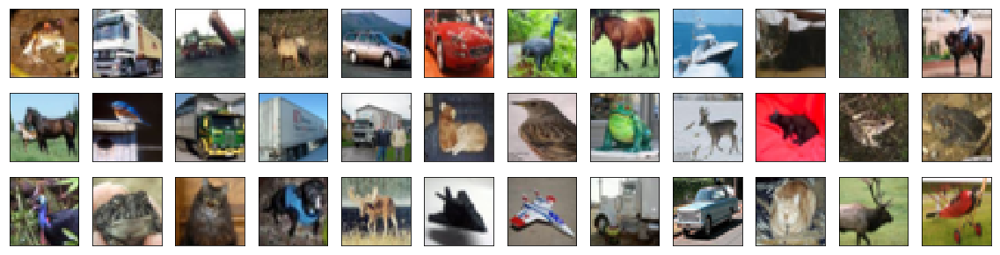

# Artificial Intelligence Nanodegree

## Convolutional Neural Networks

---

In this notebook, we train an MLP to classify images from the CIFAR-10 database.

### 1. Load CIFAR-10 Database


```python
import keras
from keras.datasets import cifar10

# load the pre-shuffled train and test data
(x_train, y_train), (x_test, y_test) = cifar10.load_data()
```

    Using TensorFlow backend.
    

### 2. Visualize the First 24 Training Images


```python
import numpy as np
import matplotlib.pyplot as plt
%matplotlib inline

fig = plt.figure(figsize=(20,5))
for i in range(36):
    ax = fig.add_subplot(3, 12, i + 1, xticks=[], yticks=[])
    ax.imshow(np.squeeze(x_train[i]))
```





### 3. Rescale the Images by Dividing Every Pixel in Every Image by 255


```python
# rescale [0,255] --> [0,1]
x_train = x_train.astype('float32')/255
x_test = x_test.astype('float32')/255 
```

### 4.  Break Dataset into Training, Testing, and Validation Sets


```python
from keras.utils import np_utils

# one-hot encode the labels
num_classes = len(np.unique(y_train))
y_train = keras.utils.to_categorical(y_train, num_classes)
y_test = keras.utils.to_categorical(y_test, num_classes)

# break training set into training and validation sets
(x_train, x_valid) = x_train[5000:], x_train[:5000]
(y_train, y_valid) = y_train[5000:], y_train[:5000]

# print shape of training set
print('x_train shape:', x_train.shape)

# print number of training, validation, and test images
print(x_train.shape[0], 'train samples')
print(x_test.shape[0], 'test samples')
print(x_valid.shape[0], 'validation samples')
```

    x_train shape: (45000, 32, 32, 3)
    45000 train samples
    10000 test samples
    5000 validation samples
    

### 5. Define the Model Architecture 


```python
from keras.models import Sequential
from keras.layers import Dense, Dropout, Flatten

# define the model
model = Sequential()
model.add(Flatten(input_shape = x_train.shape[1:]))
model.add(Dense(1000, activation='relu'))
model.add(Dropout(0.2))
model.add(Dense(512, activation='relu'))
model.add(Dropout(0.2))
model.add(Dense(num_classes, activation='softmax'))

model.summary()
```

    _________________________________________________________________
    Layer (type)                 Output Shape              Param #   
    =================================================================
    flatten_1 (Flatten)          (None, 3072)              0         
    _________________________________________________________________
    dense_1 (Dense)              (None, 1000)              3073000   
    _________________________________________________________________
    dropout_1 (Dropout)          (None, 1000)              0         
    _________________________________________________________________
    dense_2 (Dense)              (None, 512)               512512    
    _________________________________________________________________
    dropout_2 (Dropout)          (None, 512)               0         
    _________________________________________________________________
    dense_3 (Dense)              (None, 10)                5130      
    =================================================================
    Total params: 3,590,642.0
    Trainable params: 3,590,642.0
    Non-trainable params: 0.0
    _________________________________________________________________
    

### 6. Compile the Model 


```python
# compile the model
model.compile(loss='categorical_crossentropy', optimizer='rmsprop', 
                  metrics=['accuracy'])
```

### 7. Train the Model 


```python
from keras.callbacks import ModelCheckpoint   

# train the model
checkpointer = ModelCheckpoint(filepath='MLP.weights.best.hdf5', verbose=1, 
                               save_best_only=True)
hist = model.fit(x_train, y_train, batch_size=32, epochs=20,
          validation_data=(x_valid, y_valid), callbacks=[checkpointer], 
          verbose=2, shuffle=True)
```

    Train on 45000 samples, validate on 5000 samples
    Epoch 1/20
    Epoch 00000: val_loss improved from inf to 1.91876, saving model to MLP.weights.best.hdf5
    52s - loss: 3.2886 - acc: 0.2462 - val_loss: 1.9188 - val_acc: 0.3000
    Epoch 2/20
    Epoch 00001: val_loss did not improve
    54s - loss: 1.8626 - acc: 0.3242 - val_loss: 1.9204 - val_acc: 0.3082
    Epoch 3/20
    Epoch 00002: val_loss improved from 1.91876 to 1.78092, saving model to MLP.weights.best.hdf5
    52s - loss: 1.8230 - acc: 0.3438 - val_loss: 1.7809 - val_acc: 0.3588
    Epoch 4/20
    Epoch 00003: val_loss improved from 1.78092 to 1.72077, saving model to MLP.weights.best.hdf5
    54s - loss: 1.7887 - acc: 0.3575 - val_loss: 1.7208 - val_acc: 0.3640
    Epoch 5/20
    Epoch 00004: val_loss did not improve
    55s - loss: 1.7777 - acc: 0.3651 - val_loss: 1.7357 - val_acc: 0.3500
    Epoch 6/20
    Epoch 00005: val_loss improved from 1.72077 to 1.71538, saving model to MLP.weights.best.hdf5
    53s - loss: 1.7641 - acc: 0.3675 - val_loss: 1.7154 - val_acc: 0.3818
    Epoch 7/20
    Epoch 00006: val_loss did not improve
    52s - loss: 1.7616 - acc: 0.3700 - val_loss: 1.7708 - val_acc: 0.3670
    Epoch 8/20
    Epoch 00007: val_loss did not improve
    52s - loss: 1.7641 - acc: 0.3729 - val_loss: 1.7766 - val_acc: 0.3738
    Epoch 9/20
    Epoch 00008: val_loss improved from 1.71538 to 1.70597, saving model to MLP.weights.best.hdf5
    52s - loss: 1.7709 - acc: 0.3672 - val_loss: 1.7060 - val_acc: 0.3840
    Epoch 10/20
    Epoch 00009: val_loss did not improve
    51s - loss: 1.7635 - acc: 0.3744 - val_loss: 1.8535 - val_acc: 0.3260
    Epoch 11/20
    Epoch 00010: val_loss did not improve
    54s - loss: 1.7551 - acc: 0.3780 - val_loss: 1.7249 - val_acc: 0.3758
    Epoch 12/20
    Epoch 00011: val_loss did not improve
    55s - loss: 1.7617 - acc: 0.3757 - val_loss: 1.7308 - val_acc: 0.3660
    Epoch 13/20
    Epoch 00012: val_loss did not improve
    52s - loss: 1.7694 - acc: 0.3745 - val_loss: 1.9086 - val_acc: 0.3150
    Epoch 14/20
    Epoch 00013: val_loss did not improve
    53s - loss: 1.7654 - acc: 0.3711 - val_loss: 1.7625 - val_acc: 0.3684
    Epoch 15/20
    Epoch 00014: val_loss did not improve
    52s - loss: 1.7691 - acc: 0.3726 - val_loss: 1.7753 - val_acc: 0.3778
    Epoch 16/20
    Epoch 00015: val_loss did not improve
    52s - loss: 1.7780 - acc: 0.3688 - val_loss: 1.7723 - val_acc: 0.3592
    Epoch 17/20
    Epoch 00016: val_loss did not improve
    52s - loss: 1.7757 - acc: 0.3675 - val_loss: 1.7359 - val_acc: 0.3644
    Epoch 18/20
    Epoch 00017: val_loss did not improve
    54s - loss: 1.7868 - acc: 0.3676 - val_loss: 1.7861 - val_acc: 0.3538
    Epoch 19/20
    Epoch 00018: val_loss did not improve
    53s - loss: 1.7797 - acc: 0.3717 - val_loss: 1.7431 - val_acc: 0.3698
    Epoch 20/20
    Epoch 00019: val_loss improved from 1.70597 to 1.70173, saving model to MLP.weights.best.hdf5
    52s - loss: 1.7857 - acc: 0.3670 - val_loss: 1.7017 - val_acc: 0.3926
    


    <keras.callbacks.History at 0x10935a4a8>


### 8. Load the Model with the Best Classification Accuracy on the Validation Set


```python
# load the weights that yielded the best validation accuracy
model.load_weights('MLP.weights.best.hdf5')
```

### 9. Calculate Classification Accuracy on Test Set


```python
# evaluate and print test accuracy
score = model.evaluate(x_test, y_test, verbose=0)
print('\n', 'Test accuracy:', score[1])
```

    
     Test accuracy: 0.4
    
