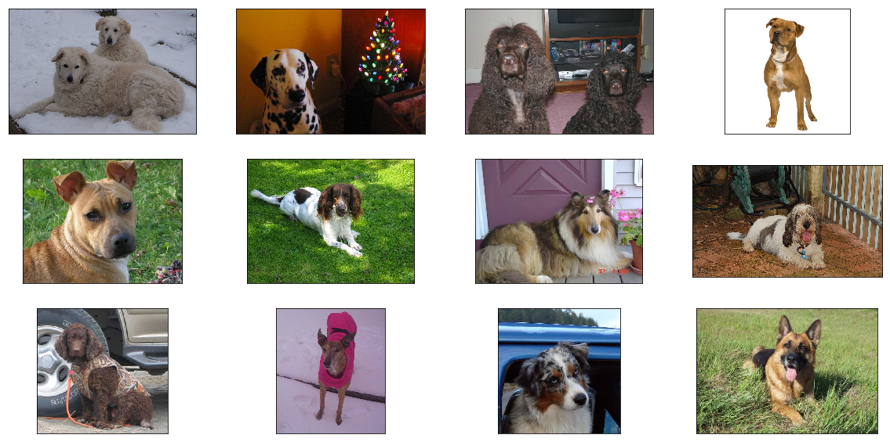

# Artificial Intelligence Nanodegree

## Convolutional Neural Networks

---

In this notebook, we use transfer learning to train a CNN to classify dog breeds.

### 1. Load Dog Dataset

Before running the code cell below, download the dataset of dog images [here](https://s3-us-west-1.amazonaws.com/udacity-aind/dog-project/dogImages.zip) and place it in the respository.


```python
from sklearn.datasets import load_files       
from keras.utils import np_utils
import numpy as np
from glob import glob

# define function to load train, test, and validation datasets
def load_dataset(path):
    data = load_files(path)
    dog_files = np.array(data['filenames'])
    dog_targets = np_utils.to_categorical(np.array(data['target']), 133)
    return dog_files, dog_targets

# load train, test, and validation datasets
train_files, train_targets = load_dataset('dogImages/train')
valid_files, valid_targets = load_dataset('dogImages/valid')
test_files, test_targets = load_dataset('dogImages/test')

# load ordered list of dog names
dog_names = [item[25:-1] for item in glob('dogImages/train/*/')]

# print statistics about the dataset
print('There are %d total dog categories.' % len(dog_names))
print('There are %s total dog images.\n' % str(len(train_files) + len(valid_files) + len(test_files)))
print('There are %d training dog images.' % len(train_files))
print('There are %d validation dog images.' % len(valid_files))
print('There are %d test dog images.'% len(test_files))
```

    There are 133 total dog categories.
    There are 8351 total dog images.
    
    There are 6680 training dog images.
    There are 835 validation dog images.
    There are 836 test dog images.
    

### 2. Visualize the First 12 Training Images


```python
import cv2
import matplotlib.pyplot as plt
%matplotlib inline

def visualize_img(img_path, ax):
    img = cv2.imread(img_path)
    ax.imshow(cv2.cvtColor(img, cv2.COLOR_BGR2RGB))
    
fig = plt.figure(figsize=(20, 10))
for i in range(12):
    ax = fig.add_subplot(3, 4, i + 1, xticks=[], yticks=[])
    visualize_img(train_files[i], ax)
```





### 3. Obtain the VGG-16 Bottleneck Features

Before running the code cell below, download the file linked [here](https://s3-us-west-1.amazonaws.com/udacity-aind/dog-project/DogVGG16Data.npz) and place it in the `bottleneck_features/` folder.


```python
bottleneck_features = np.load('bottleneck_features/DogVGG16Data.npz')
train_vgg16 = bottleneck_features['train']
valid_vgg16 = bottleneck_features['valid']
test_vgg16 = bottleneck_features['test']
```

### 4. Define a Model Architecture (Model 1)


```python
from keras.layers import Dense, Flatten
from keras.models import Sequential

model = Sequential()
model.add(Flatten(input_shape=(7, 7, 512)))
model.add(Dense(133, activation='softmax'))
model.compile(loss='categorical_crossentropy', optimizer='rmsprop', 
                  metrics=['accuracy'])
model.summary()
```

    _________________________________________________________________
    Layer (type)                 Output Shape              Param #   
    =================================================================
    flatten_1 (Flatten)          (None, 25088)             0         
    _________________________________________________________________
    dense_1 (Dense)              (None, 133)               3336837   
    =================================================================
    Total params: 3,336,837.0
    Trainable params: 3,336,837.0
    Non-trainable params: 0.0
    _________________________________________________________________
    

### 5. Define another Model Architecture (Model 2)


```python
from keras.layers import GlobalAveragePooling2D

model = Sequential()
model.add(GlobalAveragePooling2D(input_shape=(7, 7, 512)))
model.add(Dense(133, activation='softmax'))
model.summary()
```

    _________________________________________________________________
    Layer (type)                 Output Shape              Param #   
    =================================================================
    global_average_pooling2d_1 ( (None, 512)               0         
    _________________________________________________________________
    dense_2 (Dense)              (None, 133)               68229     
    =================================================================
    Total params: 68,229.0
    Trainable params: 68,229.0
    Non-trainable params: 0.0
    _________________________________________________________________
    

### 6. Compile the Model (Model 2)


```python
model.compile(loss='categorical_crossentropy', optimizer='rmsprop', 
                  metrics=['accuracy'])
```

### 7. Train the Model (Model 2)


```python
from keras.callbacks import ModelCheckpoint   

# train the model
checkpointer = ModelCheckpoint(filepath='dogvgg16.weights.best.hdf5', verbose=1, 
                               save_best_only=True)
model.fit(train_vgg16, train_targets, epochs=20, validation_data=(valid_vgg16, valid_targets), 
          callbacks=[checkpointer], verbose=1, shuffle=True)
```

    Train on 6680 samples, validate on 835 samples
    Epoch 1/20
    6176/6680 [==========================>...] - ETA: 0s - loss: 12.2983 - acc: 0.1075    Epoch 00000: val_loss improved from inf to 10.30306, saving model to dogvgg16.weights.best.hdf5
    6680/6680 [==============================] - 0s - loss: 12.1374 - acc: 0.1157 - val_loss: 10.3031 - val_acc: 0.2180
    Epoch 2/20
    6272/6680 [===========================>..] - ETA: 0s - loss: 9.5057 - acc: 0.289Epoch 00001: val_loss improved from 10.30306 to 9.09437, saving model to dogvgg16.weights.best.hdf5
    6680/6680 [==============================] - 0s - loss: 9.5096 - acc: 0.2904 - val_loss: 9.0944 - val_acc: 0.2934
    Epoch 3/20
    6176/6680 [==========================>...] - ETA: 0s - loss: 8.5208 - acc: 0.383Epoch 00002: val_loss improved from 9.09437 to 8.62564, saving model to dogvgg16.weights.best.hdf5
    6680/6680 [==============================] - 0s - loss: 8.5496 - acc: 0.3825 - val_loss: 8.6256 - val_acc: 0.3545
    Epoch 4/20
    6272/6680 [===========================>..] - ETA: 0s - loss: 8.1966 - acc: 0.43Epoch 00003: val_loss improved from 8.62564 to 8.58835, saving model to dogvgg16.weights.best.hdf5
    6680/6680 [==============================] - 0s - loss: 8.2014 - acc: 0.4341 - val_loss: 8.5884 - val_acc: 0.3737
    Epoch 5/20
    6272/6680 [===========================>..] - ETA: 0s - loss: 8.0404 - acc: 0.454Epoch 00004: val_loss improved from 8.58835 to 8.43415, saving model to dogvgg16.weights.best.hdf5
    6680/6680 [==============================] - 0s - loss: 8.0367 - acc: 0.4548 - val_loss: 8.4341 - val_acc: 0.3880
    Epoch 6/20
    6208/6680 [==========================>...] - ETA: 0s - loss: 7.8702 - acc: 0.482Epoch 00005: val_loss improved from 8.43415 to 8.39367, saving model to dogvgg16.weights.best.hdf5
    6680/6680 [==============================] - 0s - loss: 7.9029 - acc: 0.4799 - val_loss: 8.3937 - val_acc: 0.3880
    Epoch 7/20
    6272/6680 [===========================>..] - ETA: 0s - loss: 7.7087 - acc: 0.494Epoch 00006: val_loss improved from 8.39367 to 8.15991, saving model to dogvgg16.weights.best.hdf5
    6680/6680 [==============================] - 0s - loss: 7.7120 - acc: 0.4937 - val_loss: 8.1599 - val_acc: 0.3952
    Epoch 8/20
    6592/6680 [============================>.] - ETA: 0s - loss: 7.4841 - acc: 0.51Epoch 00007: val_loss improved from 8.15991 to 8.11300, saving model to dogvgg16.weights.best.hdf5
    6680/6680 [==============================] - 0s - loss: 7.4900 - acc: 0.5099 - val_loss: 8.1130 - val_acc: 0.4012
    Epoch 9/20
    6272/6680 [===========================>..] - ETA: 0s - loss: 7.3830 - acc: 0.522Epoch 00008: val_loss improved from 8.11300 to 7.97417, saving model to dogvgg16.weights.best.hdf5
    6680/6680 [==============================] - 0s - loss: 7.4015 - acc: 0.5211 - val_loss: 7.9742 - val_acc: 0.4263
    Epoch 10/20
    6240/6680 [===========================>..] - ETA: 0s - loss: 7.3192 - acc: 0.530Epoch 00009: val_loss improved from 7.97417 to 7.81060, saving model to dogvgg16.weights.best.hdf5
    6680/6680 [==============================] - 0s - loss: 7.2912 - acc: 0.5316 - val_loss: 7.8106 - val_acc: 0.4192
    Epoch 11/20
    6304/6680 [===========================>..] - ETA: 0s - loss: 7.1594 - acc: 0.538Epoch 00010: val_loss improved from 7.81060 to 7.72290, saving model to dogvgg16.weights.best.hdf5
    6680/6680 [==============================] - 0s - loss: 7.1393 - acc: 0.5398 - val_loss: 7.7229 - val_acc: 0.4323
    Epoch 12/20
    6464/6680 [============================>.] - ETA: 0s - loss: 7.0337 - acc: 0.55Epoch 00011: val_loss improved from 7.72290 to 7.63593, saving model to dogvgg16.weights.best.hdf5
    6680/6680 [==============================] - 0s - loss: 7.0393 - acc: 0.5501 - val_loss: 7.6359 - val_acc: 0.4431
    Epoch 13/20
    6528/6680 [============================>.] - ETA: 0s - loss: 6.9137 - acc: 0.55Epoch 00012: val_loss improved from 7.63593 to 7.53945, saving model to dogvgg16.weights.best.hdf5
    6680/6680 [==============================] - 0s - loss: 6.9241 - acc: 0.5584 - val_loss: 7.5394 - val_acc: 0.4515
    Epoch 14/20
    6656/6680 [============================>.] - ETA: 0s - loss: 6.7817 - acc: 0.56Epoch 00013: val_loss improved from 7.53945 to 7.46202, saving model to dogvgg16.weights.best.hdf5
    6680/6680 [==============================] - 0s - loss: 6.7815 - acc: 0.5672 - val_loss: 7.4620 - val_acc: 0.4503
    Epoch 15/20
    6528/6680 [============================>.] - ETA: 0s - loss: 6.6915 - acc: 0.57Epoch 00014: val_loss improved from 7.46202 to 7.44949, saving model to dogvgg16.weights.best.hdf5
    6680/6680 [==============================] - 0s - loss: 6.7170 - acc: 0.5774 - val_loss: 7.4495 - val_acc: 0.4575
    Epoch 16/20
    6464/6680 [============================>.] - ETA: 0s - loss: 6.7139 - acc: 0.57Epoch 00015: val_loss improved from 7.44949 to 7.35805, saving model to dogvgg16.weights.best.hdf5
    6680/6680 [==============================] - 0s - loss: 6.7033 - acc: 0.5799 - val_loss: 7.3580 - val_acc: 0.4695
    Epoch 17/20
    6208/6680 [==========================>...] - ETA: 0s - loss: 6.6917 - acc: 0.579Epoch 00016: val_loss did not improve
    6680/6680 [==============================] - 0s - loss: 6.6708 - acc: 0.5801 - val_loss: 7.4005 - val_acc: 0.4611
    Epoch 18/20
    6240/6680 [===========================>..] - ETA: 0s - loss: 6.6062 - acc: 0.577Epoch 00017: val_loss improved from 7.35805 to 7.27700, saving model to dogvgg16.weights.best.hdf5
    6680/6680 [==============================] - 0s - loss: 6.5568 - acc: 0.5804 - val_loss: 7.2770 - val_acc: 0.4575
    Epoch 19/20
    6496/6680 [============================>.] - ETA: 0s - loss: 6.4169 - acc: 0.58Epoch 00018: val_loss improved from 7.27700 to 7.19605, saving model to dogvgg16.weights.best.hdf5
    6680/6680 [==============================] - 0s - loss: 6.4140 - acc: 0.5894 - val_loss: 7.1961 - val_acc: 0.4731
    Epoch 20/20
    6400/6680 [===========================>..] - ETA: 0s - loss: 6.3179 - acc: 0.59Epoch 00019: val_loss improved from 7.19605 to 7.12832, saving model to dogvgg16.weights.best.hdf5
    6680/6680 [==============================] - 0s - loss: 6.3272 - acc: 0.5964 - val_loss: 7.1283 - val_acc: 0.4659
    


    <keras.callbacks.History at 0x126f5b898>


### 8. Load the Model with the Best Validation Accuracy (Model 2)


```python
# load the weights that yielded the best validation accuracy
model.load_weights('dogvgg16.weights.best.hdf5')
```

### 9. Calculate Classification Accuracy on Test Set (Model 2)


```python
# get index of predicted dog breed for each image in test set
vgg16_predictions = [np.argmax(model.predict(np.expand_dims(feature, axis=0))) 
                     for feature in test_vgg16]

# report test accuracy
test_accuracy = 100*np.sum(np.array(vgg16_predictions)==
                           np.argmax(test_targets, axis=1))/len(vgg16_predictions)
print('\nTest accuracy: %.4f%%' % test_accuracy)
```

    
    Test accuracy: 46.6507%
    
