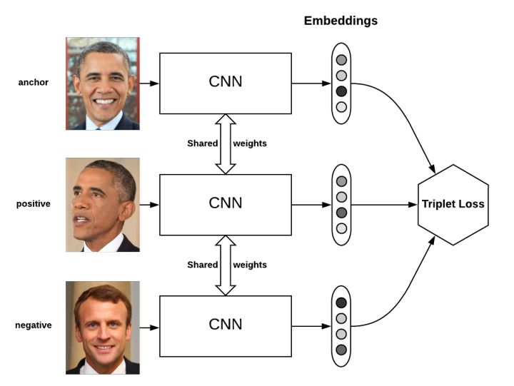
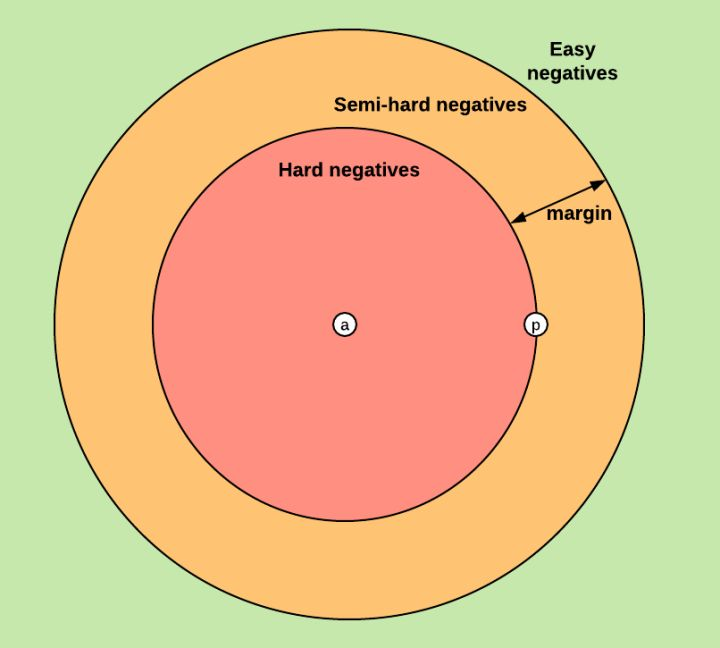

# triplet loss
Triplet loss最初是在 [FaceNet: A Unified Embedding for Face Recognition and Clustering](https://arxiv.org/abs/1503.03832) 论文中提出的，可以学到较好的人脸的embedding   

## triplet loss原理

triplet loss的目标是:  
两个具有同样标签的样本，他们在新的编码空间里距离很近。  
两个具有不同标签的样本，他们在新的编码空间里距离很远。  
进一步，我们希望两个positive examples和一个negative example中，negative example与positive example的距离，大于positive examples之间的距离，或者大于某一个阈值：margin(facenet中为0.2)   

triplet是一个三元组(a, p, n)，这个三元组是这样构成的：从训练数据集中随机选一个样本，该样本称为Anchor，然后再随机选取一个和Anchor (记为a)属于同一类的样本和不同类的样本,这两个样本对应的称为Positive (记为p)和Negative (记为n)，由此构成一个（Anchor，Positive，Negative）三元组  
a： anchor  
p： positive, 与 a 是同一类别的样本  
n： negative, 与 a 是不同类别的样本  

对于(a,p,n)这个triplet(三元组)，其triplet loss就可以写作：  
**L=max(d(a,p)−d(a,n)+margin,0)**  
最终的优化目标是拉近 (a, p) 的距离， 拉远 (a, n) 的距离,根据d(a,n)大小，将将triplet(三元组)分为三类：  
* easy triplets：L=0  即 d(a,p)+margin<d(a,n)，这种情况不需要优化，天然（a, p）的距离很近， a, n的距离远  
* hard triplets：d(a,n)<d(a,p) , 即（a, p）的距离远    
* semi-hard triplets：d(a,p)<d(a,n)<d(a,p)+margin, 即a, n的距离靠的很近，但是有一个margin    
  

FaceNet 中是随机选取semi-hard triplets 进行训练的, （也可以选择 hard triplets 或者两者一起进行训练）  

## 训练方法
### OFFLINE
离线方式是将所有的训练数据喂给神经网络，得到每一个训练样本的编码（embeddings），根据编码计算得到d(a,n)和d(a,p)，根据距离判断semi-hard triplets，hard triplets还是easy triplets,离线方式仅仅选择select hard or semi-hard triplets，因为easy triplet太容易了，没有必要训练。   
总得来说，这个方法不够高效，因为需要过一遍所有的数据，然后训练反向更新网络，而且每过1个或几个epoch，可能还要重新对negative examples进行分类。  

### ONLINE
将B张图片（一个batch）喂给神经网络，得到B张图片的embedding，可以产生  个 triplets（当然其中有不合法的，因为需要的是<a, p, n>）  

实际使用中采用此方法，又分为两种策略（来自于行人重识别的论文[In Defense of the Triplet Loss for Person Re-Identification](https://arxiv.org/abs/1703.07737)）:
* Batch All: 计算batch_size中所有有效的三元组（triplet）的hard triplet 和 semi-hard triplet， 然后取平均得到Loss，不考虑easy triplets，因为easy triplets的损失为0，平均会把整体损失缩小    
* Batch Hard：对于每一个anchor， 选择距离最大的d(a, p) 和 距离最小的 d(a, n)    

##  Tensorflow 中的实现
https://github.com/omoindrot/tensorflow-triplet-loss

## 参考
http://lawlite.me/2018/10/16/Triplet-Loss%E5%8E%9F%E7%90%86%E5%8F%8A%E5%85%B6%E5%AE%9E%E7%8E%B0/    
https://zhuanlan.zhihu.com/p/35560666

  

