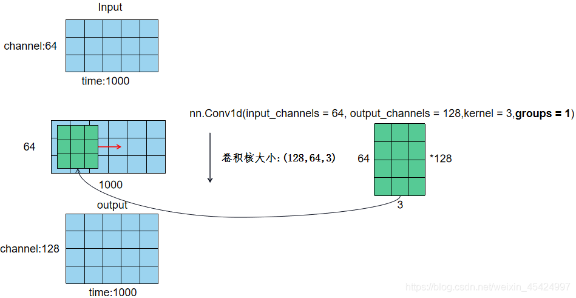
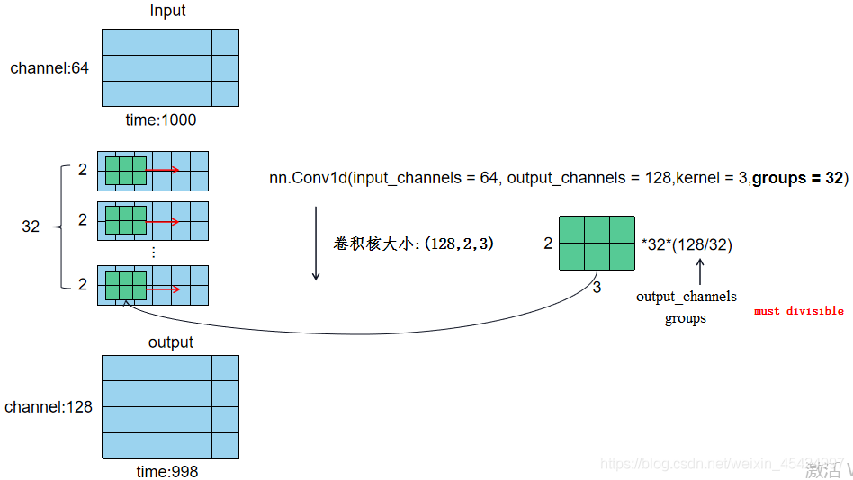
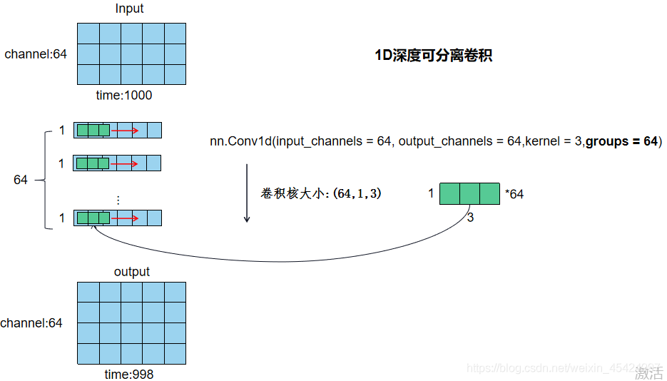

# 卷积

## 普通卷积（分离卷积）
卷积核为3、步幅为1和带有边界扩充的二维卷积结构  
  

## 空洞卷积（扩张卷积）
空洞卷积（atrous convolutions）又名扩张卷积（dilated convolutions），向卷积层引入了一个称为 “扩张率(dilation rate)”的新参数，该参数定义了卷积核处理数据时各值的间距。

在VGG网络中就证明了使用小卷积核叠加来取代大卷积核可以起到减少参数同时达到大卷积核同样大小感受野的功效。但是通过叠加小卷积核来扩大感受野只能线性增长，公式为(kernelSize−1)∗layers+1(kernelSize−1)∗layers+1(kernelSize-1)*layers+1,，也就是线性增长，而空洞卷积可以以指数级增长感受野。  

一个扩张率为2的3×3卷积核，感受野与5×5的卷积核相同，而且仅需要9个参数。你可以把它想象成一个5×5的卷积核，每隔一行或一列删除一行或一列。  

在相同的计算条件下，空洞卷积提供了更大的感受野。空洞卷积经常用在实时图像分割中。当网络层需要较大的感受野，但计算资源有限而无法提高卷积核数量或大小时，可以考虑空洞卷积。  

卷积核为3、扩张率为2和无边界扩充的二维空洞卷积  
  

## 转置卷积（反卷积）
转置卷积（transposed Convolutions）又名反卷积（deconvolution）或是分数步长卷积（fractially straced convolutions）。  

反卷积（deconvolutions）这种叫法是不合适的，因为它不符合反卷积的概念。在深度学习中，反卷积确实存在，但是并不常用。实际上，反卷积是卷积操作的逆过程。你可以这么理解这个过程，将某个图像输入到单个卷积层，取卷积层的输出传递到一个黑盒子中，这个黑盒子输出了原始图像。那么可以说，这个黑盒子完成了一个反卷积操作，也就是卷积操作的数学逆过程。  

转置卷积与真正的反卷积有点相似，因为两者产生了相同的空间分辨率。然而，这两种卷积对输入数据执行的实际数学运算是不同的。转置卷积层只执行了常规的卷积操作，但是恢复了其空间分辨率。  

卷积核为3、步幅为2和无边界扩充的二维卷积结构  
  

若要实现其逆过程，需要相应的数学逆运算，能根据每个输入像素来生成对应的9个值。然后，将步幅设为2，遍历输出图像，这就是反卷积操作。  

卷积核为3×3、步幅为2和无边界扩充的二维转置卷积  
  

转置卷积和反卷积的共同点在于两者输出都为5×5大小的图像，不过转置卷积执行的仍是常规的卷积操作。为了实现扩充目的，需要对输入以某种方式进行填充。在数值方面上，转置卷积不能实现卷积操作的逆过程。  

转置卷积只是为了重建先前的空间分辨率，执行了卷积操作。这不是卷积的数学逆过程，但是用于编码器-解码器结构中，效果仍然很好。这样，转置卷积可以同时实现图像的粗粒化和卷积操作，而不是通过两个单独过程来完成。  

## 深度可分离卷积
深度可分离卷积结构（depthwise separable convolution）将一个标准的卷积分解为为一个深度卷积（depthwise convolutions）和一个点卷积（pointwise convolution）（1 × 1卷积核）。简单理解就是矩阵的因式分解。深度卷积将每个卷积核应用到每一个通道，而1 × 1卷积用来组合通道卷积的输出，这种分解可以有效减少计算量，降低模型大小。    
  
直观上来看，这种分解在效果上确实是等价的。比如，把上图的代号化为实际的数字，输入图片维度是11 × 11 × 3，标准卷积为3 × 3 × 3 ×16（假设stride为2，padding为1），那么可以得到输出为6 × 6 × 16的输出结果。现在输入图片不变，先通过一个维度是3 × 3 × 1× 3的深度卷积（输入是3通道，这里有3个卷积核，对应着进行计算，理解成for循环），得到6 × 6 × 3的中间输出，然后再通过一个维度是1 × 1 × 3 ×16的1 ×1卷积，同样得到输出为6 × 6 × 16   

## 1x1卷积
1x1卷积核，又称为网中网（Network in Network）  
1x1卷积核作用：
* 降维/升维
* 增加非线性  
> 1*1卷积核，可以在保持feature map尺度不变的（即不损失分辨率）的前提下大幅增加非线性特性（利用后接的非线性激活函数），把网络做的很deep  
* 跨通道信息交互（channel 的变换）  
> 使用1x1卷积核，实现降维和升维的操作其实就是channel间信息的线性组合变化，3x3，64channels的卷积核后面添加一个1x1，28channels的卷积核，就变成了3x3，28channels的卷积核，原来的64个channels就可以理解为跨通道线性组合变成了28channels，这就是通道间的信息交互  

## 一维卷积
**普通一维卷积**
     

**一维分组卷积**  
       

**深度可分离一维卷积**   
深度可分离卷积是让output_channels与input_channels相同，同时groups等于input_channels.     
这时输出通道如输入通道相同，如果需要改变输出通道数，则再跟一个kernel等于1的1D卷积即可。    
 

参考：  
https://blog.csdn.net/u010349092/article/details/81607819  
http://www.dataguru.cn/article-11860-1.html    
https://blog.csdn.net/weixin_45424997/article/details/119175992    
  
